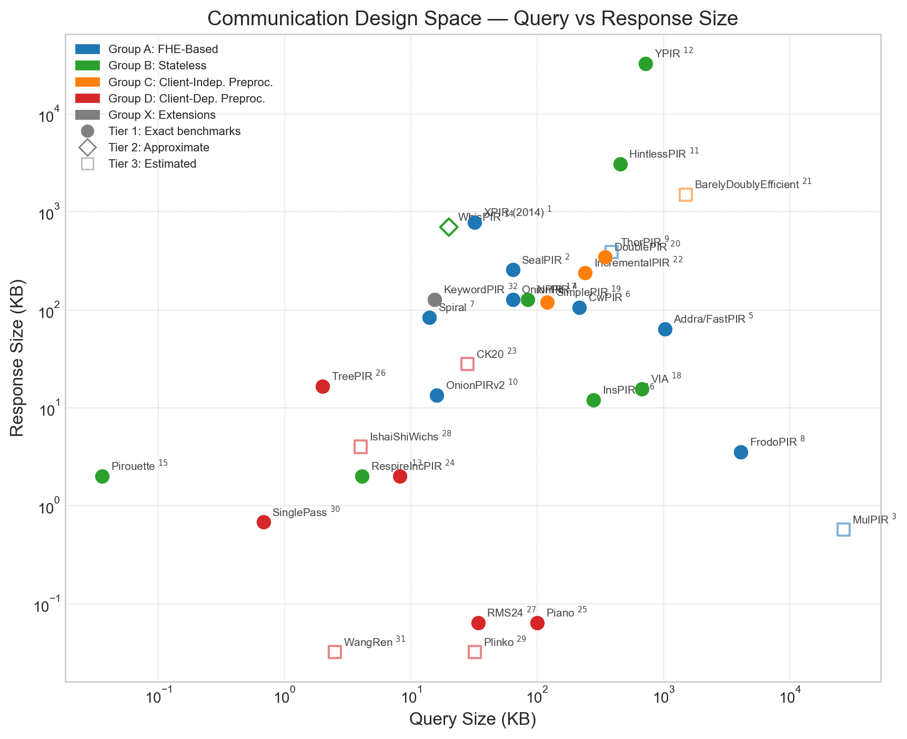
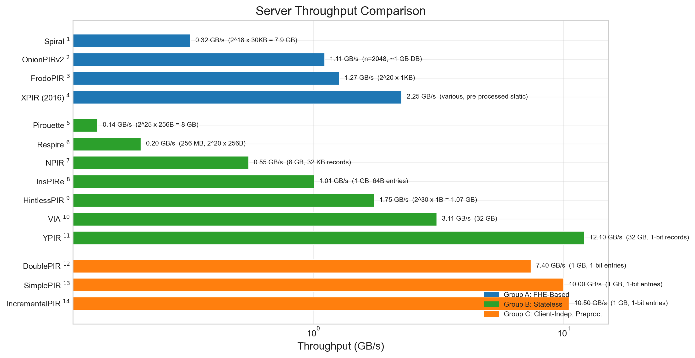
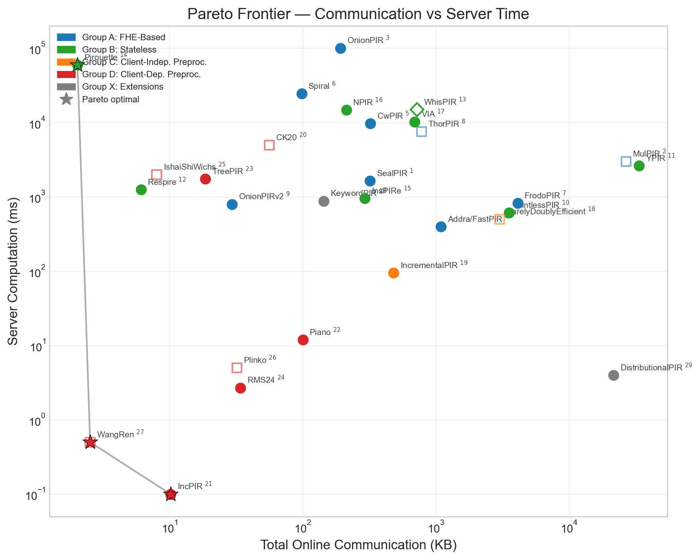

🌐 **[Comparative benchs](https://0xalizk.github.io/PIR-Eng-Notes)**

## PIR Engineering Notes

**TLDR**: [Deep reading](https://gist.github.com/0xalizk/50f0d78712c6afe952ab2f9a2cc07434) of PIR papers to extract eng. notes ([eg](Schemes/Group%20A%20-%20FHE%20Based%20PIR/thorpir_2024/thorpir_2024_notes.md)) and [visualize](https://0xalizk.github.io/PIR-Eng-Notes/) comparative benchs/asymptotics. The correctness of these notes are [continuously validated](Checkups/README.md#checking-correctness-of-cited-claims):
- Scheme grouping [based on this taxonomy](https://hackmd.io/@keewoolee/SJyGoXCzZe#Taxonomy)
- Multi-server schemes are excluded
- Engineering notes ([eg](/Schemes/Group%20A%20-%20FHE%20Based%20PIR/thorpir_2024/thorpir_2024_notes.md)) for 34 Private Information Retrieval (PIR) research papers: scheme design, complexity analysis, cryptographic assumptions, and reported benchmarks. 
- Per-scheme notes are produced by reading the source PDF (incl. tables/figures which Claude can do to some extent) using a [standardized methodology](.claude/skills/pir-paper-analyzer/SKILL.md). 
- Footnotes used ([eg](Schemes/Group%20A%20-%20FHE%20Based%20PIR/thorpir_2024/thorpir_2024_notes.md#user-content-fn-18-0fc3995a87bbbb4931a4fb224b1f904d)) to support statements and reference pages/sections of the paper.

|  |  |  |
|:---:|:---:|:---:|

### Group A — FHE-Based PIR

| Paper &nbsp; &nbsp; &nbsp; &nbsp; &nbsp; &nbsp; &nbsp; | Key Contribution |
|-------------------------------|-----------------|
| 2025 [OnionPIRv2](Schemes/Group%20A%20-%20FHE%20Based%20PIR/onionpirv2_2025/onionpirv2_2025_notes.md) | Multi-base decomposition + NTT-domain DB engineering |
| 2024 [ThorPIR](Schemes/Group%20A%20-%20FHE%20Based%20PIR/thorpir_2024/thorpir_2024_notes.md) | Client-dependent FHE preprocessing (functionally Group D) |
| 2022 [FrodoPIR](Schemes/Group%20A%20-%20FHE%20Based%20PIR/frodopir_2022/frodopir_2022_notes.md) | Plain LWE with client-independent global hint (functionally Group C) |
| 2022 [Spiral](Schemes/Group%20A%20-%20FHE%20Based%20PIR/spiral_2022/spiral_2022_notes.md) | Ciphertext translation (Regev-to-GSW), 4 Pareto-optimal variants |
| 2022 [CwPIR](Schemes/Group%20A%20-%20FHE%20Based%20PIR/cwpir_2022/cwpir_2022_notes.md) | Constant-weight equality operators, native keyword PIR |
| 2021 [FastPIR/Addra](Schemes/Group%20A%20-%20FHE%20Based%20PIR/addra_2021/addra_2021_notes.md) | System: metadata-private voice via one-hot BFV selection |
| 2021 [OnionPIR](Schemes/Group%20A%20-%20FHE%20Based%20PIR/onionpir_2021/onionpir_2021_notes.md) | External products for noise control, first <1s at scale |
| 2019 [MulPIR](Schemes/Group%20A%20-%20FHE%20Based%20PIR/mulpir_2019/mulpir_2019_notes.md) | GSW-based compressible FHE for high communication rate |
| 2018 [SealPIR](Schemes/Group%20A%20-%20FHE%20Based%20PIR/sealpir_2018/sealpir_2018_notes.md) | Query compression via BFV oblivious expansion (paradigm shift) |
| 2016 [XPIR-2016](Schemes/Group%20A%20-%20FHE%20Based%20PIR/xpir_2016/xpir_2016_notes.md) | Ring-LWE system with auto-optimization of parameters |
| 2014 [XPIR-2014](Schemes/Group%20A%20-%20FHE%20Based%20PIR/xpir_2014/xpir_2014_notes.md) | First practical NTRU-based single-server cPIR |

### Group B — Stateless Single Server PIR

| Paper &nbsp; &nbsp; &nbsp; &nbsp; &nbsp; &nbsp; &nbsp; | Key Contribution |
|-------------------------------|-----------------|
| 2026 [NPIR](Schemes/Group%20B%20-%20Stateless%20Single%20Server%20PIR/npir_2026/NPIR_2026_notes.md) | NTRU packing for high communication rate |
| 2025 [VIA](Schemes/Group%20B%20-%20Stateless%20Single%20Server%20PIR/via_2025/VIA_2025_notes.md) | DMux-CMux architecture, 3 variants (VIA/VIA-C/VIA-B) |
| 2025 [InsPIRe](Schemes/Group%20B%20-%20Stateless%20Single%20Server%20PIR/inspire_2025/InsPIRe_2025_notes.md) | InspiRING ring packing, polynomial evaluation |
| 2025 [Pirouette](Schemes/Group%20B%20-%20Stateless%20Single%20Server%20PIR/pirouette_2025/Pirouette_2025_notes.md) | 36-byte queries via blind rotation |
| 2024 [WhisPIR](Schemes/Group%20B%20-%20Stateless%20Single%20Server%20PIR/whispir_2024/WhisPIR_2024_notes.md) | BGV-based stateless PIR, non-compact BGV optimization |
| 2024 [Respire](Schemes/Group%20B%20-%20Stateless%20Single%20Server%20PIR/respire_2024/Respire_2024_notes.md) | Small-record optimization, 5-ring architecture |
| 2024 [YPIR](Schemes/Group%20B%20-%20Stateless%20Single%20Server%20PIR/ypir_2024/YPIR_2024_notes.md) | Memory-bandwidth-limited throughput, CDKS packing |
| 2023 [HintlessPIR](Schemes/Group%20B%20-%20Stateless%20Single%20Server%20PIR/hintlesspir_2023/HintlessPIR_2023_notes.md) | Composable RLWE preprocessing, LinPIR primitive |

### Group C — Client-Independent Preprocessing

| Paper &nbsp; &nbsp; &nbsp; &nbsp; &nbsp; &nbsp; &nbsp; | Key Contribution |
|-------------------------------|-----------------|
| 2026 [IncrementalPIR](Schemes/Group%20C%20-%20Client%20Independent%20Preprocessing/incrementalpir_2026/IncrementalPIR_2026_notes.md) | Entry-level incremental preprocessing for SimplePIR |
| 2025 [BarelyDoublyEfficient](Schemes/Group%20C%20-%20Client%20Independent%20Preprocessing/barelydoublyefficient_2025/BarelyDoublyEfficient_2025_notes.md) | First DEPIR from plain LWE in CRS model (theory) |
| 2024 [VeriSimplePIR](Schemes/Group%20C%20-%20Client%20Independent%20Preprocessing/verisimplepir_2024/VeriSimplePIR_2024_notes.md) | Verifiability via SIS commitments + VLHE |
| 2022 [DoublePIR](Schemes/Group%20C%20-%20Client%20Independent%20Preprocessing/simplepir_doublepir_2022/SimplePIR_DoublePIR_2022_notes.md) | Compressed hints via LWE-on-LWE composition |
| 2022 [SimplePIR](Schemes/Group%20C%20-%20Client%20Independent%20Preprocessing/simplepir_doublepir_2022/SimplePIR_DoublePIR_2022_notes.md) | 10 GB/s throughput via plain LWE matrix-vector multiply |

### Group D — Client-Dependent Preprocessing

| Paper &nbsp; &nbsp; &nbsp; &nbsp; &nbsp; &nbsp; &nbsp; | Key Contribution |
|-------------------------------|-----------------|
| 2025 [IshaiShiWichs](Schemes/Group%20D%20-%20Client%20Dependent%20Preprocessing/ishaishiwichs_2025/IshaiShiWichs_2025_notes.md) | IT-PIR constructions + OWF/SZK lower bounds |
| 2024 [WangRen](Schemes/Group%20D%20-%20Client%20Dependent%20Preprocessing/wangren_2024/WangRen_2024_notes.md) | Tight ST = O(nw) tradeoff (theory) |
| 2024 [SinglePass](Schemes/Group%20D%20-%20Client%20Dependent%20Preprocessing/singlepass_2024/SinglePass_2024_notes.md) | Streaming single-pass preprocessing, deterministic |
| 2024 [Plinko](Schemes/Group%20D%20-%20Client%20Dependent%20Preprocessing/plinko_2024/Plinko_2024_notes.md) | Invertible PRFs, Õ(1) updates (theory) |
| 2024 [RMS24](Schemes/Group%20D%20-%20Client%20Dependent%20Preprocessing/rms24_2024/RMS24_2024_notes.md) | Dummy subsets, standard correctness |
| 2023 [TreePIR](Schemes/Group%20D%20-%20Client%20Dependent%20Preprocessing/treepir_2023/TreePIR_2023_notes.md) | 2-server sublinear via wpPRF primitive |
| 2023 [Piano](Schemes/Group%20D%20-%20Client%20Dependent%20Preprocessing/piano_2023/Piano_2023_notes.md) | First practical sublinear-server, PRF-only |
| 2021 [IncPIR](Schemes/Group%20D%20-%20Client%20Dependent%20Preprocessing/incpir_2021/IncPIR_2021_notes.md) | Incremental hint updates, mutation model |
| 2019 [CK20](Schemes/Group%20D%20-%20Client%20Dependent%20Preprocessing/ck20_2019/CK20_2019_notes.md) | First sublinear-server cPIR (theory), puncturable pseudorandom sets |

### Group X — Extensions

| Paper &nbsp; &nbsp; &nbsp; &nbsp; &nbsp; &nbsp; &nbsp; | Key Contribution |
|-------------------------------|-----------------|
| 2025 [DistributionalPIR](Schemes/Group%20X%20-%20Extensions/distributionalpir_2025/DistributionalPIR_2025_notes.md) | Distribution-dependent PIR model + compiler framework |
| 2019 [KeywordPIR](Schemes/Group%20X%20-%20Extensions/keywordpir_2019/KeywordPIR_2019_notes.md)&#8201;[^1] | Comparison of SealPIR, MulPIR, Gentry-Ramzan for keyword PIR |

[^1]: The "MulPIR" referenced in KeywordPIR is the Ali et al. [[1]](https://eprint.iacr.org/2019/1483) implementation of Gentry & Halevi's "Compressible FHE with Applications to PIR" [[2]](https://eprint.iacr.org/2019/733), which is already covered under [mulpir_2019](Schemes/Group%20A%20-%20FHE%20Based%20PIR/mulpir_2019/mulpir_2019_notes.md#mulpir--engineering-notes). Open-source implementations: [[3](https://github.com/apple/swift-homomorphic-encryption)] [[4](https://github.com/tlepoint/fhe.rs)].

### Note: schemes below span multiple groups

| &nbsp; &nbsp; &nbsp; &nbsp; $\color{darkorange}{\textsf{Scheme}}$ &nbsp; &nbsp; &nbsp; &nbsp; | $\color{darkorange}{\textsf{Why}}$ |
|:----------------------------------------------------------------------:|-----|
| 2025&nbsp;[VIA](Schemes/Group%20B%20-%20Stateless%20Single%20Server%20PIR/via_2025/VIA_2025_notes.md) | Base VIA is Group B (hintless); VIA-C straddles B/C — its offline evaluation-key upload is client-independent preprocessing |
| 2024&nbsp;[ThorPIR](Schemes/Group%20A%20-%20FHE%20Based%20PIR/thorpir_2024/thorpir_2024_notes.md) | Group A + D hybrid — FHE-based construction, but client sends encrypted PRG seeds and server performs per-client homomorphic preprocessing |
| 2022&nbsp;[FrodoPIR](Schemes/Group%20A%20-%20FHE%20Based%20PIR/frodopir_2022/frodopir_2022_notes.md) | Filed A (LWE-based) but functionally Group C — server computes a single client-independent global hint matrix; no per-client preprocessing |
| 2022&nbsp;[CwPIR](Schemes/Group%20A%20-%20FHE%20Based%20PIR/cwpir_2022/cwpir_2022_notes.md) | Filed A (FHE-based) but its core innovation — constant-weight equality operators — enables native single-round keyword PIR (a Group X extension model) |
