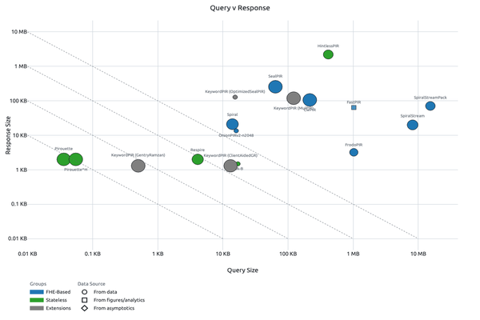
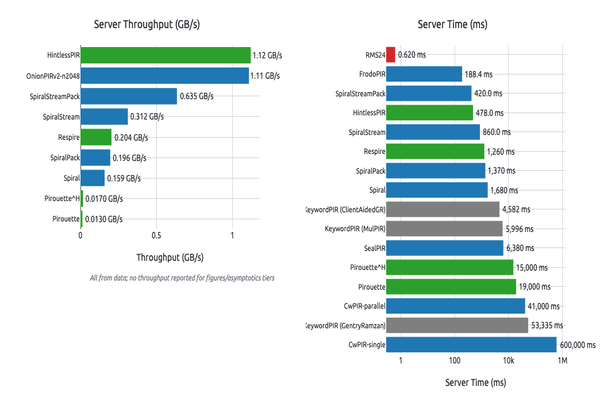
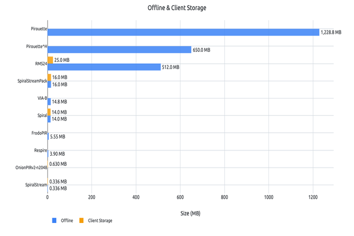

🌐 **[Comparative benchs](https://0xalizk.github.io/PIR-Eng-Notes)**

## PIR Engineering Notes

**TLDR**: [Deep reading](https://gist.github.com/0xalizk/50f0d78712c6afe952ab2f9a2cc07434) of PIR papers to extract eng. notes ([eg](research/Group.2b.Interactive.Hint/thorpir_2024/thorpir_2024_notes.md)) and [visualize](https://0xalizk.github.io/PIR-Eng-Notes/) comparative benchs/asymptotics. The correctness of these notes are [continuously validated](checkups/README.md#checking-correctness-of-cited-claims):
- Scheme grouping [based on this taxonomy](https://notes.ethereum.org/U9xM4VOPR9isPK7lOZJUQg?view#41-Taxonomy) (client state architecture)
- Multi-server schemes are excluded
- Engineering notes ([eg](research/Group.2b.Interactive.Hint/thorpir_2024/thorpir_2024_notes.md)) for 30 Private Information Retrieval (PIR) scheme entries with [validated](https://github.com/0xalizk/PIR-Eng-Notes/tree/main/.claude/skills/footnotes-checkup) [[2]](https://github.com/0xalizk/PIR-Eng-Notes/tree/main/checkups#checking-correctness-of-cited-claims) footnotes
- Per-scheme notes are produced by reading the source PDF (incl. tables/figures which Claude can do) using a [standardized methodology](.claude/skills/pir-paper-analyzer/SKILL.md).
- Classification rationale for each scheme is documented in [research/README.md](research/README.md)

|  |  |  |
|:---:|:---:|:---:|

### Group 1a — Stateless Client, Stateful Server

Server caches per-client cryptographic material (evaluation keys). Queries linkable across sessions.

| Paper &nbsp; &nbsp; &nbsp; &nbsp; &nbsp; &nbsp; &nbsp; | Key Contribution |
|-------------------------------|-----------------|
| 2026 [NPIR](research/Group.1a.Stateless.Client.Stateful.Server/npir_2026/NPIR_2026_notes.md) | NTRU packing for high communication rate |
| 2025 [VIA-BC](research/Group.1b.Stateless.Client.Stateless.Server/via_2025/VIA_2025_notes.md) | VIA-C/VIA-B variants: LWE-to-RLWE query compression + batch repacking; 14.8 MB per-client eval keys |
| 2025 [OnionPIRv2](research/Group.1a.Stateless.Client.Stateful.Server/onionpirv2_2025/onionpirv2_2025_notes.md) | Multi-base decomposition + NTT-domain DB engineering |
| 2025 [Pirouette](research/Group.1a.Stateless.Client.Stateful.Server/pirouette_2025/Pirouette_2025_notes.md) | 36-byte queries via blind rotation |
| 2024 [WhisPIR](research/Group.1a.Stateless.Client.Stateful.Server/whispir_2024/WhisPIR_2024_notes.md) | BGV-based, non-compact BGV optimization |
| 2024 [Respire](research/Group.1a.Stateless.Client.Stateful.Server/respire_2024/Respire_2024_notes.md) | Small-record optimization, 5-ring architecture |
| 2022 [Spiral](research/Group.1a.Stateless.Client.Stateful.Server/spiral_2022/spiral_2022_notes.md) | Ciphertext translation (Regev-to-GSW), 4 Pareto-optimal variants |
| 2022 [CwPIR](research/Group.1a.Stateless.Client.Stateful.Server/cwpir_2022/cwpir_2022_notes.md) | Constant-weight equality operators, native keyword PIR |
| 2021 [FastPIR/Addra](research/Group.1a.Stateless.Client.Stateful.Server/addra_2021/addra_2021_notes.md) | System: metadata-private voice via one-hot BFV selection |
| 2021 [OnionPIR](research/Group.1a.Stateless.Client.Stateful.Server/onionpir_2021/onionpir_2021_notes.md) | External products for noise control, first <1s at scale |
| 2019 [MulPIR](research/Group.1a.Stateless.Client.Stateful.Server/mulpir_2019/mulpir_2019_notes.md) | GSW-based compressible FHE for high communication rate |
| 2018 [SealPIR](research/Group.1a.Stateless.Client.Stateful.Server/sealpir_2018/sealpir_2018_notes.md) | Query compression via BFV oblivious expansion (paradigm shift) |
| 2016 [XPIR-2016](research/Group.1a.Stateless.Client.Stateful.Server/xpir_2016/xpir_2016_notes.md) | Ring-LWE system with auto-optimization of parameters |
| 2014 [XPIR-2014](research/Group.1a.Stateless.Client.Stateful.Server/xpir_2014/xpir_2014_notes.md) | First practical NTRU-based single-server cPIR |

### Group 1b — Stateless Client, Stateless Server

No per-client state anywhere. Server preprocesses DB into a shared structure.

| Paper &nbsp; &nbsp; &nbsp; &nbsp; &nbsp; &nbsp; &nbsp; | Key Contribution |
|-------------------------------|-----------------|
| 2025 [VIA](research/Group.1b.Stateless.Client.Stateless.Server/via_2025/VIA_2025_notes.md) | DMux-CMux architecture, fully hintless (base variant) |
| 2025 [InsPIRe](research/Group.1b.Stateless.Client.Stateless.Server/inspire_2025/InsPIRe_2025_notes.md) | InspiRING ring packing, polynomial evaluation |
| 2024 [YPIR](research/Group.1b.Stateless.Client.Stateless.Server/ypir_2024/YPIR_2024_notes.md) | Memory-bandwidth-limited throughput, CDKS packing |
| 2023 [HintlessPIR](research/Group.1b.Stateless.Client.Stateless.Server/hintlesspir_2023/HintlessPIR_2023_notes.md) | Composable RLWE preprocessing, LinPIR primitive |

### Group 2a — Download-Hint

Client downloads server-computed global hint. Hint generation is server→client only (one-directional).

| Paper &nbsp; &nbsp; &nbsp; &nbsp; &nbsp; &nbsp; &nbsp; | Key Contribution |
|-------------------------------|-----------------|
| 2026 [IncrementalPIR](research/Group.2a.Download.Hint/incrementalpir_2026/IncrementalPIR_2026_notes.md) | Entry-level incremental preprocessing for SimplePIR |
| 2024 [VeriSimplePIR](research/Group.2a.Download.Hint/verisimplepir_2024/VeriSimplePIR_2024_notes.md) | Verifiability via SIS commitments + VLHE |
| 2022 [FrodoPIR](research/Group.2a.Download.Hint/frodopir_2022/frodopir_2022_notes.md) | Plain LWE with client-independent global hint |
| 2022 [DoublePIR](research/Group.2a.Download.Hint/simplepir_doublepir_2022/SimplePIR_DoublePIR_2022_notes.md) | Compressed hints via LWE-on-LWE composition |
| 2022 [SimplePIR](research/Group.2a.Download.Hint/simplepir_doublepir_2022/SimplePIR_DoublePIR_2022_notes.md) | 10 GB/s throughput via plain LWE matrix-vector multiply |

### Group 2b — Interactive-Hint

Hint generation requires client↔server communication. Only category achieving sublinear online server time.

| Paper &nbsp; &nbsp; &nbsp; &nbsp; &nbsp; &nbsp; &nbsp; | Key Contribution |
|-------------------------------|-----------------|
| 2024 [ThorPIR](research/Group.2b.Interactive.Hint/thorpir_2024/thorpir_2024_notes.md) | Client-dependent FHE preprocessing |
| 2024 [WangRen](research/Group.2b.Interactive.Hint/wangren_2024/WangRen_2024_notes.md) | Tight ST = O(nw) tradeoff (theory) |
| 2024 [Plinko](research/Group.2b.Interactive.Hint/plinko_2024/Plinko_2024_notes.md) | Invertible PRFs, Õ(1) updates (theory) |
| 2024 [RMS24](research/Group.2b.Interactive.Hint/rms24_2024/RMS24_2024_notes.md) | Dummy subsets, standard correctness |
| 2023 [Piano](research/Group.2b.Interactive.Hint/piano_2023/Piano_2023_notes.md) | First practical sublinear-server, PRF-only |

### Group X — Extensions

| Paper &nbsp; &nbsp; &nbsp; &nbsp; &nbsp; &nbsp; &nbsp; | Key Contribution |
|-------------------------------|-----------------|
| 2025 [DistributionalPIR](research/Group.X.Extensions/distributionalpir_2025/DistributionalPIR_2025_notes.md) | Distribution-dependent PIR model + compiler framework |
| 2019 [KeywordPIR](research/Group.X.Extensions/keywordpir_2019/KeywordPIR_2019_notes.md)&#8201;[^1] | Comparison of SealPIR, MulPIR, Gentry-Ramzan for keyword PIR |

[^1]: The "MulPIR" referenced in KeywordPIR is the Ali et al. [[1]](https://eprint.iacr.org/2019/1483) implementation of Gentry & Halevi's "Compressible FHE with Applications to PIR" [[2]](https://eprint.iacr.org/2019/733), which is already covered under [mulpir_2019](research/Group.1a.Stateless.Client.Stateful.Server/mulpir_2019/mulpir_2019_notes.md#mulpir--engineering-notes). Open-source implementations: [[3](https://github.com/apple/swift-homomorphic-encryption)] [[4](https://github.com/tlepoint/fhe.rs)].
