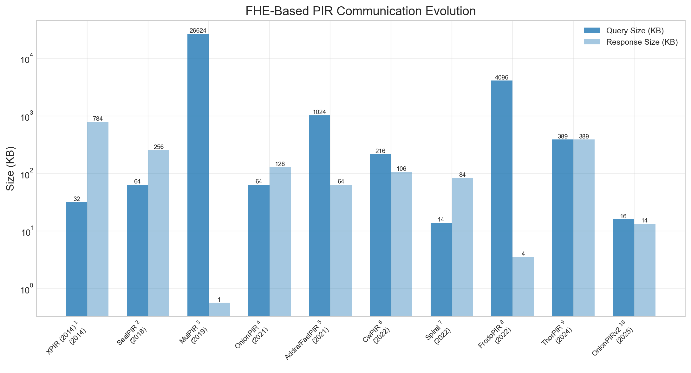
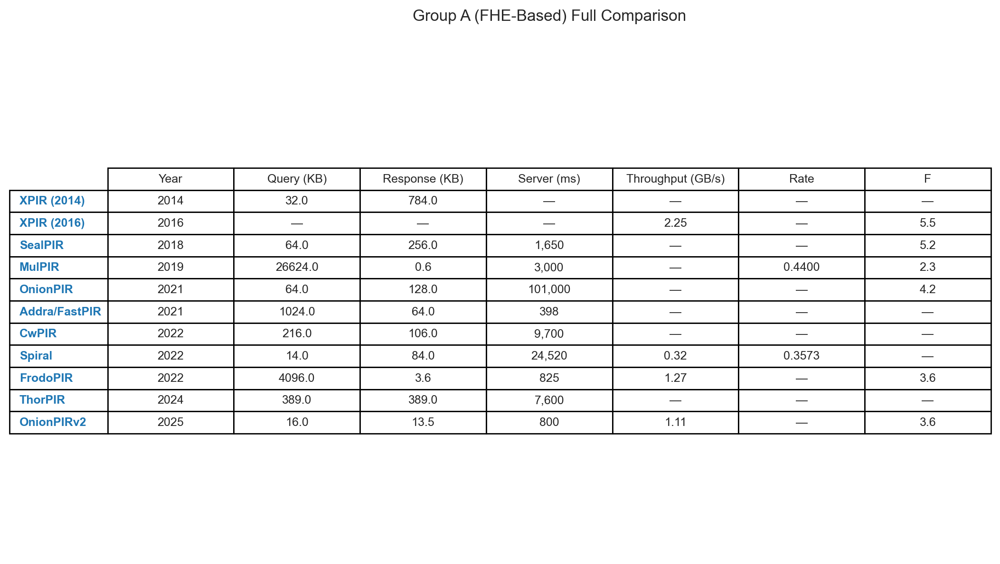

## Group A — FHE-Based PIR

### FHE Efficiency Frontier — Expansion Factor vs Server Time

| |
|:---:|
|  |
| **FHE Efficiency Frontier — Expansion Factor vs Server Time.** Scatter of expansion factor vs server time for FHE-based schemes. Schemes: SealPIR1, MulPIR2, OnionPIR3, FrodoPIR4, OnionPIRv25 |

${\color{#E67300}\textbf{Citations and Footnotes}}$

1. **SealPIR** — Figure 9 in [sealpir_2018_notes.md](../../../Schemes/Group%20A%20-%20FHE%20Based%20PIR/sealpir_2018/sealpir_2018_notes.md#performance-benchmarks)
2. **MulPIR** — Section 5, Appendix A in [mulpir_2019_notes.md](../../../Schemes/Group%20A%20-%20FHE%20Based%20PIR/mulpir_2019/mulpir_2019_notes.md#performance-benchmarks) *[estimated, confidence: moderate]*
3. **OnionPIR** — Table 3, Table 4 in [onionpir_2021_notes.md](../../../Schemes/Group%20A%20-%20FHE%20Based%20PIR/onionpir_2021/onionpir_2021_notes.md#performance-benchmarks)
4. **FrodoPIR** — Table 6, Table 7 in [frodopir_2022_notes.md](../../../Schemes/Group%20A%20-%20FHE%20Based%20PIR/frodopir_2022/frodopir_2022_notes.md#performance-benchmarks)
5. **OnionPIRv2** — Table 2 in [onionpirv2_2025_notes.md](../../../Schemes/Group%20A%20-%20FHE%20Based%20PIR/onionpirv2_2025/onionpirv2_2025_notes.md#performance-benchmarks)

### FHE-Based PIR Communication Evolution

| |
|:---:|
|  |
| **FHE-Based PIR Communication Evolution.** Paired bar chart showing query/response size evolution across FHE-based schemes. Schemes: XPIR (2014)1, SealPIR2, MulPIR3, OnionPIR4, Addra/FastPIR5, CwPIR6, Spiral7, FrodoPIR8, ThorPIR9, OnionPIRv210 |

${\color{#E67300}\textbf{Citations and Footnotes}}$

1. **XPIR (2014)** — Table 2, Table 3 in [xpir_2014_notes.md](../../../Schemes/Group%20A%20-%20FHE%20Based%20PIR/xpir_2014/xpir_2014_notes.md#performance-benchmarks)
2. **SealPIR** — Figure 9 in [sealpir_2018_notes.md](../../../Schemes/Group%20A%20-%20FHE%20Based%20PIR/sealpir_2018/sealpir_2018_notes.md#performance-benchmarks)
3. **MulPIR** — Section 5, Appendix A in [mulpir_2019_notes.md](../../../Schemes/Group%20A%20-%20FHE%20Based%20PIR/mulpir_2019/mulpir_2019_notes.md#performance-benchmarks) *[estimated, confidence: moderate]*
4. **OnionPIR** — Table 3, Table 4 in [onionpir_2021_notes.md](../../../Schemes/Group%20A%20-%20FHE%20Based%20PIR/onionpir_2021/onionpir_2021_notes.md#performance-benchmarks)
5. **Addra/FastPIR** — Figure 9, Figure 10 in [addra_2021_notes.md](../../../Schemes/Group%20A%20-%20FHE%20Based%20PIR/addra_2021/addra_2021_notes.md#performance-benchmarks)
6. **CwPIR** — Table 7, Table 8 in [cwpir_2022_notes.md](../../../Schemes/Group%20A%20-%20FHE%20Based%20PIR/cwpir_2022/cwpir_2022_notes.md#performance-benchmarks)
7. **Spiral** — Table 3, Table 5 in [spiral_2022_notes.md](../../../Schemes/Group%20A%20-%20FHE%20Based%20PIR/spiral_2022/spiral_2022_notes.md#performance-benchmarks)
8. **FrodoPIR** — Table 6, Table 7 in [frodopir_2022_notes.md](../../../Schemes/Group%20A%20-%20FHE%20Based%20PIR/frodopir_2022/frodopir_2022_notes.md#performance-benchmarks)
9. **ThorPIR** — Table 2 in [thorpir_2024_notes.md](../../../Schemes/Group%20A%20-%20FHE%20Based%20PIR/thorpir_2024/thorpir_2024_notes.md#performance-benchmarks) *[estimated, confidence: moderate]*
10. **OnionPIRv2** — Table 2 in [onionpirv2_2025_notes.md](../../../Schemes/Group%20A%20-%20FHE%20Based%20PIR/onionpirv2_2025/onionpirv2_2025_notes.md#performance-benchmarks)

### Group A (FHE-Based) Full Comparison

| |
|:---:|
|  |
| **Group A (FHE-Based) Full Comparison.** Full comparison table of all Group A schemes. Schemes: XPIR (2014)1, XPIR (2016)2, SealPIR3, MulPIR4, OnionPIR5, Addra/FastPIR6, CwPIR7, Spiral8, FrodoPIR9, ThorPIR10, OnionPIRv211 |

${\color{#E67300}\textbf{Citations and Footnotes}}$

1. **XPIR (2014)** — Table 2, Table 3 in [xpir_2014_notes.md](../../../Schemes/Group%20A%20-%20FHE%20Based%20PIR/xpir_2014/xpir_2014_notes.md#performance-benchmarks)
2. **XPIR (2016)** — Figure 6, Figure 7, Figure 8 in [xpir_2016_notes.md](../../../Schemes/Group%20A%20-%20FHE%20Based%20PIR/xpir_2016/xpir_2016_notes.md#performance-benchmarks)
3. **SealPIR** — Figure 9 in [sealpir_2018_notes.md](../../../Schemes/Group%20A%20-%20FHE%20Based%20PIR/sealpir_2018/sealpir_2018_notes.md#performance-benchmarks)
4. **MulPIR** — Section 5, Appendix A in [mulpir_2019_notes.md](../../../Schemes/Group%20A%20-%20FHE%20Based%20PIR/mulpir_2019/mulpir_2019_notes.md#performance-benchmarks) *[estimated, confidence: moderate]*
5. **OnionPIR** — Table 3, Table 4 in [onionpir_2021_notes.md](../../../Schemes/Group%20A%20-%20FHE%20Based%20PIR/onionpir_2021/onionpir_2021_notes.md#performance-benchmarks)
6. **Addra/FastPIR** — Figure 9, Figure 10 in [addra_2021_notes.md](../../../Schemes/Group%20A%20-%20FHE%20Based%20PIR/addra_2021/addra_2021_notes.md#performance-benchmarks)
7. **CwPIR** — Table 7, Table 8 in [cwpir_2022_notes.md](../../../Schemes/Group%20A%20-%20FHE%20Based%20PIR/cwpir_2022/cwpir_2022_notes.md#performance-benchmarks)
8. **Spiral** — Table 3, Table 5 in [spiral_2022_notes.md](../../../Schemes/Group%20A%20-%20FHE%20Based%20PIR/spiral_2022/spiral_2022_notes.md#performance-benchmarks)
9. **FrodoPIR** — Table 6, Table 7 in [frodopir_2022_notes.md](../../../Schemes/Group%20A%20-%20FHE%20Based%20PIR/frodopir_2022/frodopir_2022_notes.md#performance-benchmarks)
10. **ThorPIR** — Table 2 in [thorpir_2024_notes.md](../../../Schemes/Group%20A%20-%20FHE%20Based%20PIR/thorpir_2024/thorpir_2024_notes.md#performance-benchmarks) *[estimated, confidence: moderate]*
11. **OnionPIRv2** — Table 2 in [onionpirv2_2025_notes.md](../../../Schemes/Group%20A%20-%20FHE%20Based%20PIR/onionpirv2_2025/onionpirv2_2025_notes.md#performance-benchmarks)

