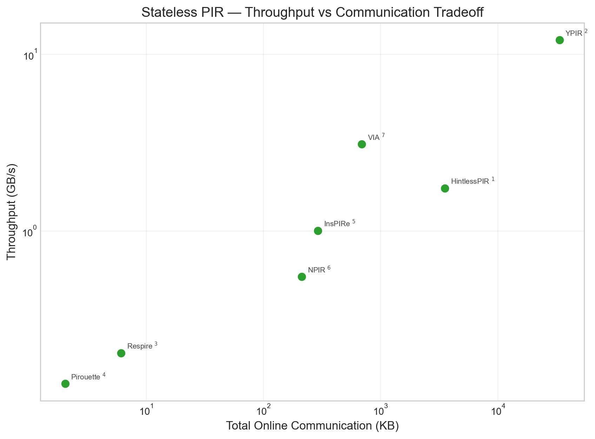
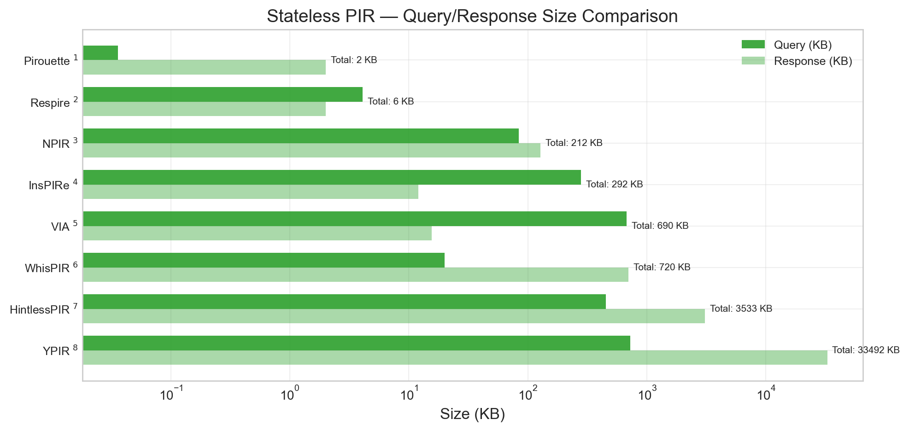
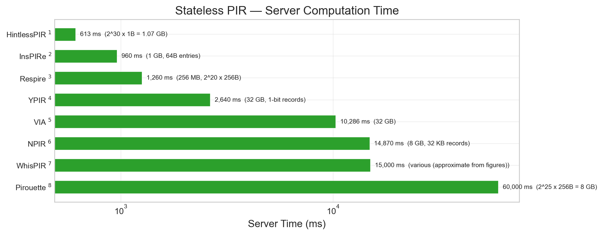

## Group B — Stateless Single-Server PIR

### Stateless PIR — Throughput vs Communication Tradeoff

| |
|:---:|
|  |
| **Stateless PIR — Throughput vs Communication Tradeoff.** Throughput vs total online communication scatter for stateless schemes. Schemes: HintlessPIR1, YPIR2, Respire3, Pirouette4, InsPIRe5, NPIR6, VIA7 |

Footnotes

1. **HintlessPIR** — Table 1, Table 2 in [HintlessPIR_2023_notes.md](../../../Schemes/Group%20B%20-%20Stateless%20Single%20Server%20PIR/hintlesspir_2023/HintlessPIR_2023_notes.md#performance-benchmarks)
2. **YPIR** — Table 2 in [YPIR_2024_notes.md](../../../Schemes/Group%20B%20-%20Stateless%20Single%20Server%20PIR/ypir_2024/YPIR_2024_notes.md#performance-benchmarks)
3. **Respire** — Table 1, Table 2 in [Respire_2024_notes.md](../../../Schemes/Group%20B%20-%20Stateless%20Single%20Server%20PIR/respire_2024/Respire_2024_notes.md#performance-benchmarks)
4. **Pirouette** — Table 7 in [Pirouette_2025_notes.md](../../../Schemes/Group%20B%20-%20Stateless%20Single%20Server%20PIR/pirouette_2025/Pirouette_2025_notes.md#performance-benchmarks)
5. **InsPIRe** — Table 2, Table 3 in [InsPIRe_2025_notes.md](../../../Schemes/Group%20B%20-%20Stateless%20Single%20Server%20PIR/inspire_2025/InsPIRe_2025_notes.md#performance-benchmarks)
6. **NPIR** — Table 1 in [NPIR_2025_notes.md](../../../Schemes/Group%20B%20-%20Stateless%20Single%20Server%20PIR/npir_2025/NPIR_2025_notes.md#performance-benchmarks)
7. **VIA** — Table 1, Table 2 in [VIA_2025_notes.md](../../../Schemes/Group%20B%20-%20Stateless%20Single%20Server%20PIR/via_2025/VIA_2025_notes.md#performance-benchmarks)

### Stateless PIR — Query/Response Size Comparison

| |
|:---:|
|  |
| **Stateless PIR — Query/Response Size Comparison.** Paired horizontal bars of query/response sizes sorted by total communication. Schemes: Pirouette1, Respire2, NPIR3, InsPIRe4, VIA5, WhisPIR6, HintlessPIR7, YPIR8 |

Footnotes

1. **Pirouette** — Table 7 in [Pirouette_2025_notes.md](../../../Schemes/Group%20B%20-%20Stateless%20Single%20Server%20PIR/pirouette_2025/Pirouette_2025_notes.md#performance-benchmarks)
2. **Respire** — Table 1, Table 2 in [Respire_2024_notes.md](../../../Schemes/Group%20B%20-%20Stateless%20Single%20Server%20PIR/respire_2024/Respire_2024_notes.md#performance-benchmarks)
3. **NPIR** — Table 1 in [NPIR_2025_notes.md](../../../Schemes/Group%20B%20-%20Stateless%20Single%20Server%20PIR/npir_2025/NPIR_2025_notes.md#performance-benchmarks)
4. **InsPIRe** — Table 2, Table 3 in [InsPIRe_2025_notes.md](../../../Schemes/Group%20B%20-%20Stateless%20Single%20Server%20PIR/inspire_2025/InsPIRe_2025_notes.md#performance-benchmarks)
5. **VIA** — Table 1, Table 2 in [VIA_2025_notes.md](../../../Schemes/Group%20B%20-%20Stateless%20Single%20Server%20PIR/via_2025/VIA_2025_notes.md#performance-benchmarks)
6. **WhisPIR** — Figure 1, Figure 2, Figure 4 in [WhisPIR_2024_notes.md](../../../Schemes/Group%20B%20-%20Stateless%20Single%20Server%20PIR/whispir_2024/WhisPIR_2024_notes.md#performance-benchmarks)
7. **HintlessPIR** — Table 1, Table 2 in [HintlessPIR_2023_notes.md](../../../Schemes/Group%20B%20-%20Stateless%20Single%20Server%20PIR/hintlesspir_2023/HintlessPIR_2023_notes.md#performance-benchmarks)
8. **YPIR** — Table 2 in [YPIR_2024_notes.md](../../../Schemes/Group%20B%20-%20Stateless%20Single%20Server%20PIR/ypir_2024/YPIR_2024_notes.md#performance-benchmarks)

### Stateless PIR — Server Computation Time

| |
|:---:|
|  |
| **Stateless PIR — Server Computation Time.** Horizontal bar chart of server computation time for stateless schemes. Schemes: HintlessPIR1, InsPIRe2, Respire3, YPIR4, VIA5, NPIR6, WhisPIR7, Pirouette8 |

Footnotes

1. **HintlessPIR** — Table 1, Table 2 in [HintlessPIR_2023_notes.md](../../../Schemes/Group%20B%20-%20Stateless%20Single%20Server%20PIR/hintlesspir_2023/HintlessPIR_2023_notes.md#performance-benchmarks)
2. **InsPIRe** — Table 2, Table 3 in [InsPIRe_2025_notes.md](../../../Schemes/Group%20B%20-%20Stateless%20Single%20Server%20PIR/inspire_2025/InsPIRe_2025_notes.md#performance-benchmarks)
3. **Respire** — Table 1, Table 2 in [Respire_2024_notes.md](../../../Schemes/Group%20B%20-%20Stateless%20Single%20Server%20PIR/respire_2024/Respire_2024_notes.md#performance-benchmarks)
4. **YPIR** — Table 2 in [YPIR_2024_notes.md](../../../Schemes/Group%20B%20-%20Stateless%20Single%20Server%20PIR/ypir_2024/YPIR_2024_notes.md#performance-benchmarks)
5. **VIA** — Table 1, Table 2 in [VIA_2025_notes.md](../../../Schemes/Group%20B%20-%20Stateless%20Single%20Server%20PIR/via_2025/VIA_2025_notes.md#performance-benchmarks)
6. **NPIR** — Table 1 in [NPIR_2025_notes.md](../../../Schemes/Group%20B%20-%20Stateless%20Single%20Server%20PIR/npir_2025/NPIR_2025_notes.md#performance-benchmarks)
7. **WhisPIR** — Figure 1, Figure 2, Figure 4 in [WhisPIR_2024_notes.md](../../../Schemes/Group%20B%20-%20Stateless%20Single%20Server%20PIR/whispir_2024/WhisPIR_2024_notes.md#performance-benchmarks)
8. **Pirouette** — Table 7 in [Pirouette_2025_notes.md](../../../Schemes/Group%20B%20-%20Stateless%20Single%20Server%20PIR/pirouette_2025/Pirouette_2025_notes.md#performance-benchmarks)

