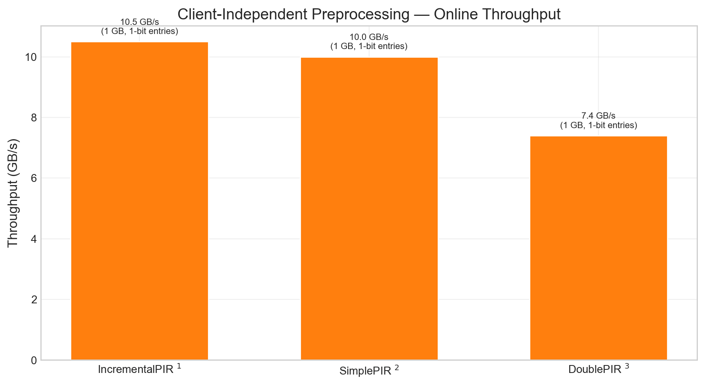
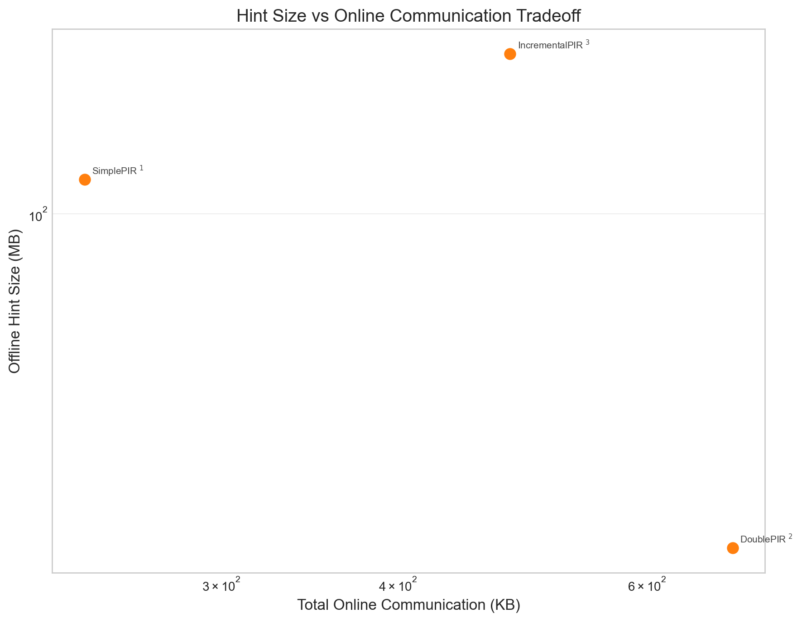

## Group C — Client-Independent Preprocessing

### Client-Independent Preprocessing — Online Throughput

| |
|:---:|
|  |
| **Client-Independent Preprocessing — Online Throughput.** Bar chart of online throughput for preprocessing-based schemes. Schemes: IncrementalPIR1, SimplePIR2, DoublePIR3 |

Footnotes

1. **IncrementalPIR** — Table 2 in [IncrementalPIR_2026_notes.md](../../../Schemes/Group%20C%20-%20Client%20Independent%20Preprocessing/incrementalpir_2026/IncrementalPIR_2026_notes.md#performance-benchmarks)
2. **SimplePIR** — Table 1, Table 8 in [SimplePIR_DoublePIR_2022_notes.md](../../../Schemes/Group%20C%20-%20Client%20Independent%20Preprocessing/simplepir_doublepir_2022/SimplePIR_DoublePIR_2022_notes.md#performance-benchmarks)
3. **DoublePIR** — Table 1, Table 8 in [SimplePIR_DoublePIR_2022_notes.md](../../../Schemes/Group%20C%20-%20Client%20Independent%20Preprocessing/simplepir_doublepir_2022/SimplePIR_DoublePIR_2022_notes.md#performance-benchmarks)

### Hint Size vs Online Communication Tradeoff

| |
|:---:|
|  |
| **Hint Size vs Online Communication Tradeoff.** Scatter of offline hint size vs online communication. Schemes: SimplePIR1, DoublePIR2, IncrementalPIR3 |

Footnotes

1. **SimplePIR** — Table 1, Table 8 in [SimplePIR_DoublePIR_2022_notes.md](../../../Schemes/Group%20C%20-%20Client%20Independent%20Preprocessing/simplepir_doublepir_2022/SimplePIR_DoublePIR_2022_notes.md#performance-benchmarks)
2. **DoublePIR** — Table 1, Table 8 in [SimplePIR_DoublePIR_2022_notes.md](../../../Schemes/Group%20C%20-%20Client%20Independent%20Preprocessing/simplepir_doublepir_2022/SimplePIR_DoublePIR_2022_notes.md#performance-benchmarks)
3. **IncrementalPIR** — Table 2 in [IncrementalPIR_2026_notes.md](../../../Schemes/Group%20C%20-%20Client%20Independent%20Preprocessing/incrementalpir_2026/IncrementalPIR_2026_notes.md#performance-benchmarks)

### Throughput Scaling with Database Size

| |
|:---:|
|  |
| **Throughput Scaling with Database Size.** Throughput scaling with database size (multi-point where available). Schemes: Respire1, SimplePIR2, DoublePIR3, IncrementalPIR4 |

Footnotes

1. **Respire** — Table 1, Table 2 in [Respire_2024_notes.md](../../../Schemes/Group%20B%20-%20Stateless%20Single%20Server%20PIR/respire_2024/Respire_2024_notes.md#performance-benchmarks)
2. **SimplePIR** — Table 1, Table 8 in [SimplePIR_DoublePIR_2022_notes.md](../../../Schemes/Group%20C%20-%20Client%20Independent%20Preprocessing/simplepir_doublepir_2022/SimplePIR_DoublePIR_2022_notes.md#performance-benchmarks)
3. **DoublePIR** — Table 1, Table 8 in [SimplePIR_DoublePIR_2022_notes.md](../../../Schemes/Group%20C%20-%20Client%20Independent%20Preprocessing/simplepir_doublepir_2022/SimplePIR_DoublePIR_2022_notes.md#performance-benchmarks)
4. **IncrementalPIR** — Table 2 in [IncrementalPIR_2026_notes.md](../../../Schemes/Group%20C%20-%20Client%20Independent%20Preprocessing/incrementalpir_2026/IncrementalPIR_2026_notes.md#performance-benchmarks)

