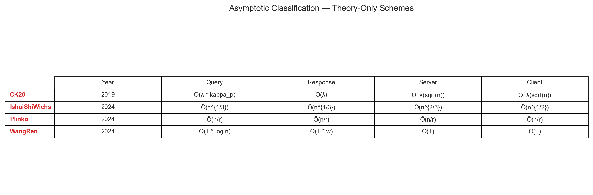

## Group D — Client-Dependent Preprocessing

### Client-Dependent Preprocessing — Online Server Latency

| |
|:---:|
|  |
| **Client-Dependent Preprocessing — Online Server Latency.** Horizontal bar chart of online server latency (log scale). Schemes: IncPIR1, WangRen2, RMS243, Plinko4, Piano5, TreePIR6, IshaiShiWichs7, CK208 |

${\color{#E67300}\textbf{Citations and Footnotes}}$

1. **IncPIR** — Figure 9, Figure 10 in [IncPIR_2021_notes.md](../../../Schemes/Group%20D%20-%20Client%20Dependent%20Preprocessing/incpir_2021/IncPIR_2021_notes.md#performance-benchmarks)
2. **WangRen** — Theorem 4.1 in [WangRen_2024_notes.md](../../../Schemes/Group%20D%20-%20Client%20Dependent%20Preprocessing/wangren_2024/WangRen_2024_notes.md#performance-benchmarks) *[estimated, confidence: moderate]*
3. **RMS24** — Table 2, Table 3 in [RMS24_2023_notes.md](../../../Schemes/Group%20D%20-%20Client%20Dependent%20Preprocessing/rms24_2023/RMS24_2023_notes.md#performance-benchmarks)
4. **Plinko** — Figure 1, Figure 6 in [Plinko_2024_notes.md](../../../Schemes/Group%20D%20-%20Client%20Dependent%20Preprocessing/plinko_2024/Plinko_2024_notes.md#performance-benchmarks) *[estimated, confidence: low]*
5. **Piano** — Table 1 in [Piano_2023_notes.md](../../../Schemes/Group%20D%20-%20Client%20Dependent%20Preprocessing/piano_2023/Piano_2023_notes.md#performance-benchmarks)
6. **TreePIR** — Figure 7, Figure 8, Figure 9 in [TreePIR_2023_notes.md](../../../Schemes/Group%20D%20-%20Client%20Dependent%20Preprocessing/treepir_2023/TreePIR_2023_notes.md#performance-benchmarks)
7. **IshaiShiWichs** — Table 1, Theorem 4.4 in [IshaiShiWichs_2024_notes.md](../../../Schemes/Group%20D%20-%20Client%20Dependent%20Preprocessing/ishaishiwichs_2024/IshaiShiWichs_2024_notes.md#performance-benchmarks) *[estimated, confidence: low]*
8. **CK20** — Theorem 14 in [CK20_2019_notes.md](../../../Schemes/Group%20D%20-%20Client%20Dependent%20Preprocessing/ck20_2019/CK20_2019_notes.md#performance-benchmarks) *[estimated, confidence: low]*

### Server vs Client Online Latency

| |
|:---:|
|  |
| **Server vs Client Online Latency.** Scatter of server vs client online latency; bubble size indicates client storage. Schemes: IncPIR1, Piano2, TreePIR3, RMS244 |

${\color{#E67300}\textbf{Citations and Footnotes}}$

1. **IncPIR** — Figure 9, Figure 10 in [IncPIR_2021_notes.md](../../../Schemes/Group%20D%20-%20Client%20Dependent%20Preprocessing/incpir_2021/IncPIR_2021_notes.md#performance-benchmarks)
2. **Piano** — Table 1 in [Piano_2023_notes.md](../../../Schemes/Group%20D%20-%20Client%20Dependent%20Preprocessing/piano_2023/Piano_2023_notes.md#performance-benchmarks)
3. **TreePIR** — Figure 7, Figure 8, Figure 9 in [TreePIR_2023_notes.md](../../../Schemes/Group%20D%20-%20Client%20Dependent%20Preprocessing/treepir_2023/TreePIR_2023_notes.md#performance-benchmarks)
4. **RMS24** — Table 2, Table 3 in [RMS24_2023_notes.md](../../../Schemes/Group%20D%20-%20Client%20Dependent%20Preprocessing/rms24_2023/RMS24_2023_notes.md#performance-benchmarks)

### Client Storage vs Server Computation Tradeoff

| |
|:---:|
|  |
| **Client Storage vs Server Computation Tradeoff.** Scatter of client storage vs server computation tradeoff. Schemes: Piano1, Plinko2, WangRen3 |

${\color{#E67300}\textbf{Citations and Footnotes}}$

1. **Piano** — Table 1 in [Piano_2023_notes.md](../../../Schemes/Group%20D%20-%20Client%20Dependent%20Preprocessing/piano_2023/Piano_2023_notes.md#performance-benchmarks)
2. **Plinko** — Figure 1, Figure 6 in [Plinko_2024_notes.md](../../../Schemes/Group%20D%20-%20Client%20Dependent%20Preprocessing/plinko_2024/Plinko_2024_notes.md#performance-benchmarks) *[estimated, confidence: low]*
3. **WangRen** — Theorem 4.1 in [WangRen_2024_notes.md](../../../Schemes/Group%20D%20-%20Client%20Dependent%20Preprocessing/wangren_2024/WangRen_2024_notes.md#performance-benchmarks) *[estimated, confidence: moderate]*

### Asymptotic Classification — Theory-Only Schemes

| |
|:---:|
|  |
| **Asymptotic Classification — Theory-Only Schemes.** Asymptotic complexity table for theory-only Group D schemes. Schemes: CK201, IshaiShiWichs2, Plinko3, WangRen4 |

${\color{#E67300}\textbf{Citations and Footnotes}}$

1. **CK20** — Theorem 14 in [CK20_2019_notes.md](../../../Schemes/Group%20D%20-%20Client%20Dependent%20Preprocessing/ck20_2019/CK20_2019_notes.md#performance-benchmarks) *[estimated, confidence: low]*
2. **IshaiShiWichs** — Table 1, Theorem 4.4 in [IshaiShiWichs_2024_notes.md](../../../Schemes/Group%20D%20-%20Client%20Dependent%20Preprocessing/ishaishiwichs_2024/IshaiShiWichs_2024_notes.md#performance-benchmarks) *[estimated, confidence: low]*
3. **Plinko** — Figure 1, Figure 6 in [Plinko_2024_notes.md](../../../Schemes/Group%20D%20-%20Client%20Dependent%20Preprocessing/plinko_2024/Plinko_2024_notes.md#performance-benchmarks) *[estimated, confidence: low]*
4. **WangRen** — Theorem 4.1 in [WangRen_2024_notes.md](../../../Schemes/Group%20D%20-%20Client%20Dependent%20Preprocessing/wangren_2024/WangRen_2024_notes.md#performance-benchmarks) *[estimated, confidence: moderate]*

