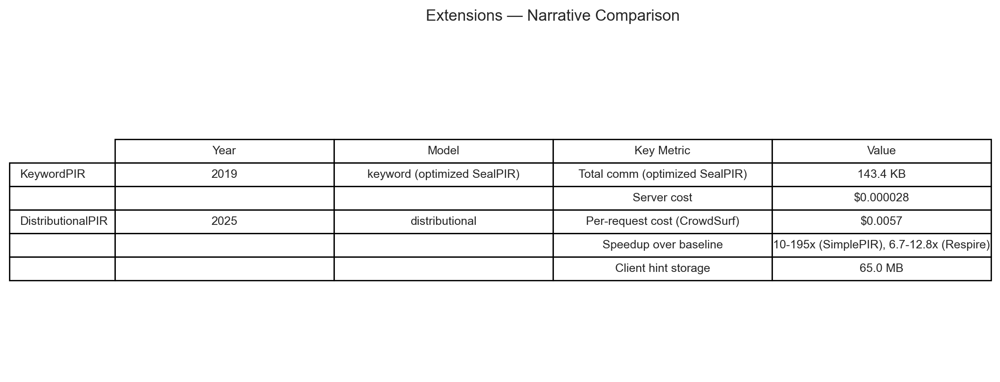

## Group X — Extensions

### Extensions — Narrative Comparison

| |
|:---:|
|  |
| **Extensions — Narrative Comparison.** Narrative comparison table for extension/variant PIR schemes. Schemes: KeywordPIR1, DistributionalPIR2 |

${\color{#E67300}\textbf{Citations and Footnotes}}$

1. **KeywordPIR** — Table 3, Table 4 in [KeywordPIR_2019_notes.md](../../../Schemes/Group%20X%20-%20Extensions/keywordpir_2019/KeywordPIR_2019_notes.md#performance-benchmarks)
2. **DistributionalPIR** — Section 7.2.1, Figure 9, Figure 10, Table 12 in [DistributionalPIR_2025_notes.md](../../../Schemes/Group%20X%20-%20Extensions/distributionalpir_2025/DistributionalPIR_2025_notes.md#performance-benchmarks)

