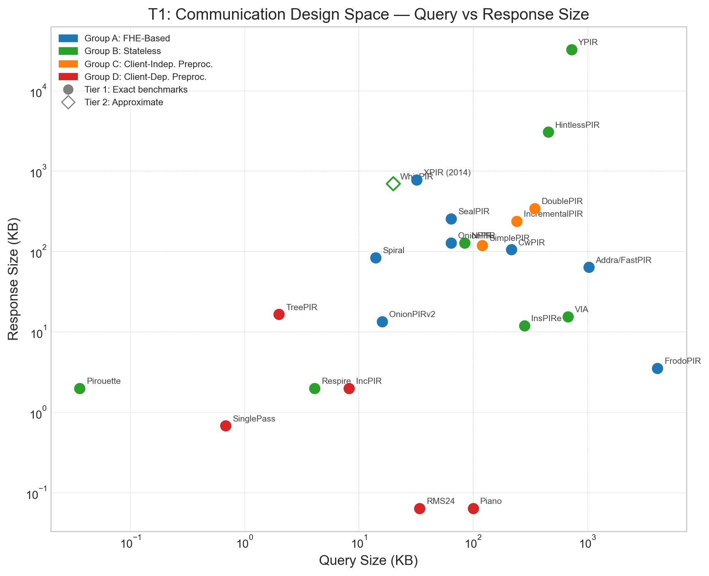
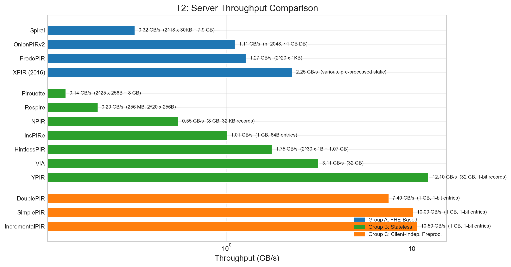
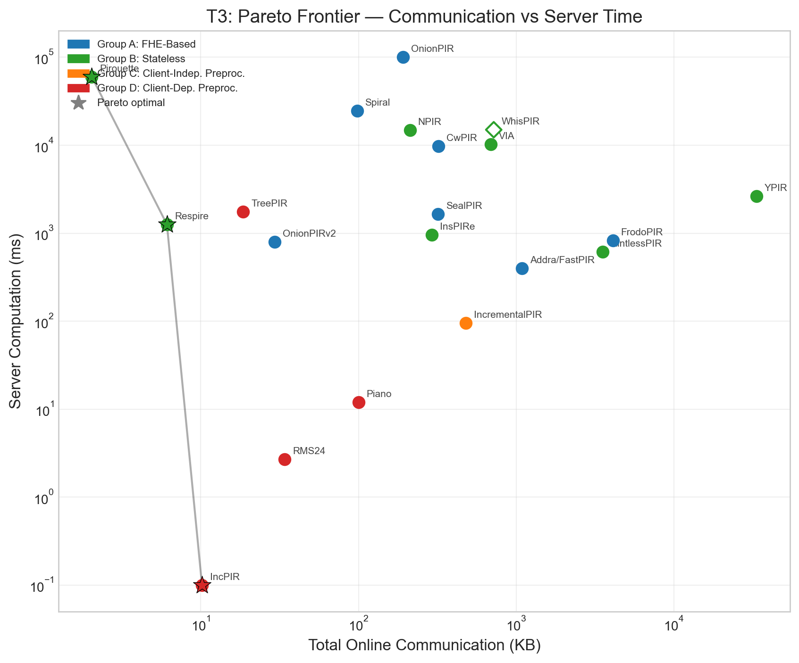
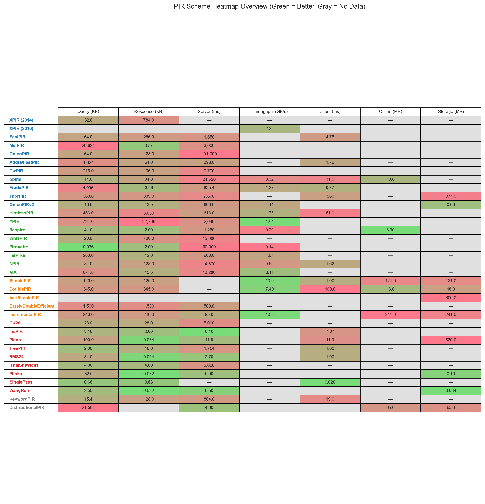
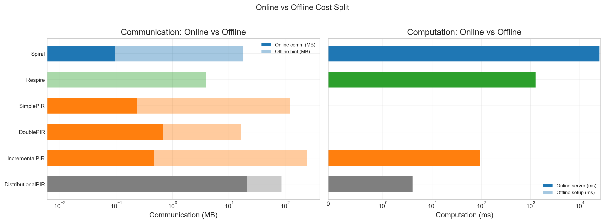
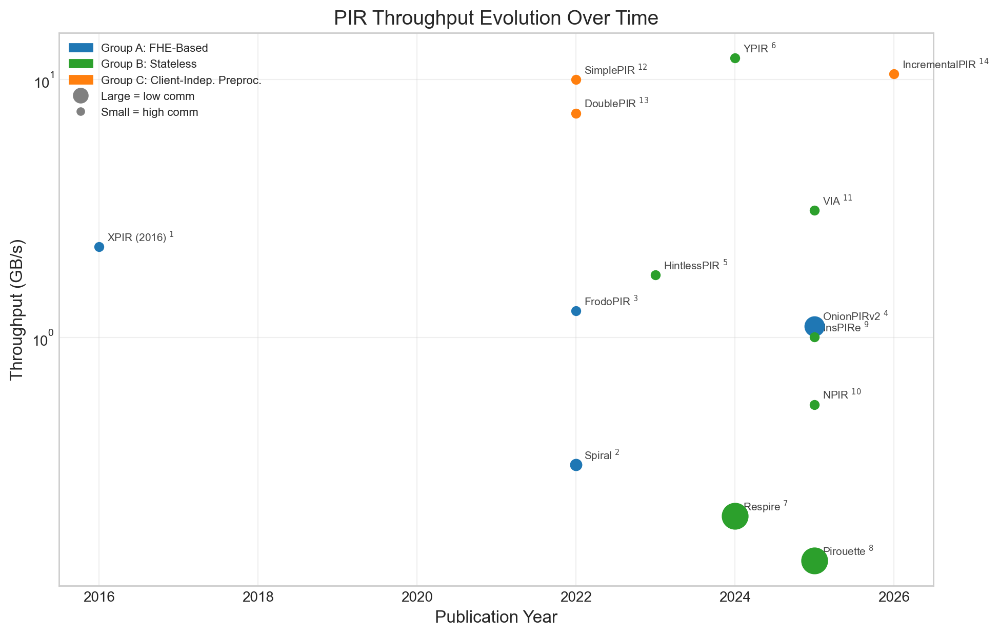

## Top-Level Cross-Group PIR Plots

### Communication Design Space — Query vs Response Size

| |
|:---:|
|  |
| **Communication Design Space — Query vs Response Size.** Log-log scatter of query vs response size across all groups. Schemes: XPIR (2014)1, SealPIR2, MulPIR3, OnionPIR4, Addra/FastPIR5, CwPIR6, Spiral7, FrodoPIR8, ThorPIR9, OnionPIRv210, HintlessPIR11, YPIR12, Respire13, WhisPIR14, Pirouette15, InsPIRe16, NPIR17, VIA18, SimplePIR19, DoublePIR20, BarelyDoublyEfficient21, IncrementalPIR22, CK2023, IncPIR24, Piano25, TreePIR26, RMS2427, IshaiShiWichs28, Plinko29, SinglePass30, WangRen31, KeywordPIR32 |

${\color{#E67300}\textbf{Citations and Footnotes}}$

1. **XPIR (2014)** — Table 2, Table 3 in [xpir_2014_notes.md](../../../Schemes/Group%20A%20-%20FHE%20Based%20PIR/xpir_2014/xpir_2014_notes.md#performance-benchmarks)
2. **SealPIR** — Figure 9 in [sealpir_2018_notes.md](../../../Schemes/Group%20A%20-%20FHE%20Based%20PIR/sealpir_2018/sealpir_2018_notes.md#performance-benchmarks)
3. **MulPIR** — Section 5, Appendix A in [mulpir_2019_notes.md](../../../Schemes/Group%20A%20-%20FHE%20Based%20PIR/mulpir_2019/mulpir_2019_notes.md#performance-benchmarks) *[estimated, confidence: moderate]*
4. **OnionPIR** — Table 3, Table 4 in [onionpir_2021_notes.md](../../../Schemes/Group%20A%20-%20FHE%20Based%20PIR/onionpir_2021/onionpir_2021_notes.md#performance-benchmarks)
5. **Addra/FastPIR** — Figure 9, Figure 10 in [addra_2021_notes.md](../../../Schemes/Group%20A%20-%20FHE%20Based%20PIR/addra_2021/addra_2021_notes.md#performance-benchmarks)
6. **CwPIR** — Table 7, Table 8 in [cwpir_2022_notes.md](../../../Schemes/Group%20A%20-%20FHE%20Based%20PIR/cwpir_2022/cwpir_2022_notes.md#performance-benchmarks)
7. **Spiral** — Table 3, Table 5 in [spiral_2022_notes.md](../../../Schemes/Group%20A%20-%20FHE%20Based%20PIR/spiral_2022/spiral_2022_notes.md#performance-benchmarks)
8. **FrodoPIR** — Table 6, Table 7 in [frodopir_2022_notes.md](../../../Schemes/Group%20A%20-%20FHE%20Based%20PIR/frodopir_2022/frodopir_2022_notes.md#performance-benchmarks)
9. **ThorPIR** — Table 2 in [thorpir_2024_notes.md](../../../Schemes/Group%20A%20-%20FHE%20Based%20PIR/thorpir_2024/thorpir_2024_notes.md#performance-benchmarks) *[estimated, confidence: moderate]*
10. **OnionPIRv2** — Table 2 in [onionpirv2_2025_notes.md](../../../Schemes/Group%20A%20-%20FHE%20Based%20PIR/onionpirv2_2025/onionpirv2_2025_notes.md#performance-benchmarks)
11. **HintlessPIR** — Table 1, Table 2 in [HintlessPIR_2023_notes.md](../../../Schemes/Group%20B%20-%20Stateless%20Single%20Server%20PIR/hintlesspir_2023/HintlessPIR_2023_notes.md#performance-benchmarks)
12. **YPIR** — Table 2 in [YPIR_2024_notes.md](../../../Schemes/Group%20B%20-%20Stateless%20Single%20Server%20PIR/ypir_2024/YPIR_2024_notes.md#performance-benchmarks)
13. **Respire** — Table 1, Table 2 in [Respire_2024_notes.md](../../../Schemes/Group%20B%20-%20Stateless%20Single%20Server%20PIR/respire_2024/Respire_2024_notes.md#performance-benchmarks)
14. **WhisPIR** — Figure 1, Figure 2, Figure 4 in [WhisPIR_2024_notes.md](../../../Schemes/Group%20B%20-%20Stateless%20Single%20Server%20PIR/whispir_2024/WhisPIR_2024_notes.md#performance-benchmarks)
15. **Pirouette** — Table 7 in [Pirouette_2025_notes.md](../../../Schemes/Group%20B%20-%20Stateless%20Single%20Server%20PIR/pirouette_2025/Pirouette_2025_notes.md#performance-benchmarks)
16. **InsPIRe** — Table 2, Table 3 in [InsPIRe_2025_notes.md](../../../Schemes/Group%20B%20-%20Stateless%20Single%20Server%20PIR/inspire_2025/InsPIRe_2025_notes.md#performance-benchmarks)
17. **NPIR** — Table 1 in [NPIR_2025_notes.md](../../../Schemes/Group%20B%20-%20Stateless%20Single%20Server%20PIR/npir_2025/NPIR_2025_notes.md#performance-benchmarks)
18. **VIA** — Table 1, Table 2 in [VIA_2025_notes.md](../../../Schemes/Group%20B%20-%20Stateless%20Single%20Server%20PIR/via_2025/VIA_2025_notes.md#performance-benchmarks)
19. **SimplePIR** — Table 1, Table 8 in [SimplePIR_DoublePIR_2022_notes.md](../../../Schemes/Group%20C%20-%20Client%20Independent%20Preprocessing/simplepir_doublepir_2022/SimplePIR_DoublePIR_2022_notes.md#performance-benchmarks)
20. **DoublePIR** — Table 1, Table 8 in [SimplePIR_DoublePIR_2022_notes.md](../../../Schemes/Group%20C%20-%20Client%20Independent%20Preprocessing/simplepir_doublepir_2022/SimplePIR_DoublePIR_2022_notes.md#performance-benchmarks)
21. **BarelyDoublyEfficient** — Theorem 3.1 in [BarelyDoublyEfficient_2025_notes.md](../../../Schemes/Group%20C%20-%20Client%20Independent%20Preprocessing/barelydoublyefficient_2025/BarelyDoublyEfficient_2025_notes.md#performance-benchmarks) *[estimated, confidence: low]*
22. **IncrementalPIR** — Table 2 in [IncrementalPIR_2026_notes.md](../../../Schemes/Group%20C%20-%20Client%20Independent%20Preprocessing/incrementalpir_2026/IncrementalPIR_2026_notes.md#performance-benchmarks)
23. **CK20** — Theorem 14 in [CK20_2019_notes.md](../../../Schemes/Group%20D%20-%20Client%20Dependent%20Preprocessing/ck20_2019/CK20_2019_notes.md#performance-benchmarks) *[estimated, confidence: low]*
24. **IncPIR** — Figure 9, Figure 10 in [IncPIR_2021_notes.md](../../../Schemes/Group%20D%20-%20Client%20Dependent%20Preprocessing/incpir_2021/IncPIR_2021_notes.md#performance-benchmarks)
25. **Piano** — Table 1 in [Piano_2023_notes.md](../../../Schemes/Group%20D%20-%20Client%20Dependent%20Preprocessing/piano_2023/Piano_2023_notes.md#performance-benchmarks)
26. **TreePIR** — Figure 7, Figure 8, Figure 9 in [TreePIR_2023_notes.md](../../../Schemes/Group%20D%20-%20Client%20Dependent%20Preprocessing/treepir_2023/TreePIR_2023_notes.md#performance-benchmarks)
27. **RMS24** — Table 2, Table 3 in [RMS24_2023_notes.md](../../../Schemes/Group%20D%20-%20Client%20Dependent%20Preprocessing/rms24_2023/RMS24_2023_notes.md#performance-benchmarks)
28. **IshaiShiWichs** — Table 1, Theorem 4.4 in [IshaiShiWichs_2024_notes.md](../../../Schemes/Group%20D%20-%20Client%20Dependent%20Preprocessing/ishaishiwichs_2024/IshaiShiWichs_2024_notes.md#performance-benchmarks) *[estimated, confidence: low]*
29. **Plinko** — Figure 1, Figure 6 in [Plinko_2024_notes.md](../../../Schemes/Group%20D%20-%20Client%20Dependent%20Preprocessing/plinko_2024/Plinko_2024_notes.md#performance-benchmarks) *[estimated, confidence: low]*
30. **SinglePass** — Table 2 in [SinglePass_2024_notes.md](../../../Schemes/Group%20D%20-%20Client%20Dependent%20Preprocessing/singlepass_2024/SinglePass_2024_notes.md#performance-benchmarks)
31. **WangRen** — Theorem 4.1 in [WangRen_2024_notes.md](../../../Schemes/Group%20D%20-%20Client%20Dependent%20Preprocessing/wangren_2024/WangRen_2024_notes.md#performance-benchmarks) *[estimated, confidence: moderate]*
32. **KeywordPIR** — Table 3, Table 4 in [KeywordPIR_2019_notes.md](../../../Schemes/Group%20X%20-%20Extensions/keywordpir_2019/KeywordPIR_2019_notes.md#performance-benchmarks)

### Server Throughput Comparison

| |
|:---:|
|  |
| **Server Throughput Comparison.** Horizontal bar chart of server throughput (GB/s) by group. Schemes: Spiral1, OnionPIRv22, FrodoPIR3, XPIR (2016)4, Pirouette5, Respire6, NPIR7, InsPIRe8, HintlessPIR9, VIA10, YPIR11, DoublePIR12, SimplePIR13, IncrementalPIR14 |

${\color{#E67300}\textbf{Citations and Footnotes}}$

1. **Spiral** — Table 3, Table 5 in [spiral_2022_notes.md](../../../Schemes/Group%20A%20-%20FHE%20Based%20PIR/spiral_2022/spiral_2022_notes.md#performance-benchmarks)
2. **OnionPIRv2** — Table 2 in [onionpirv2_2025_notes.md](../../../Schemes/Group%20A%20-%20FHE%20Based%20PIR/onionpirv2_2025/onionpirv2_2025_notes.md#performance-benchmarks)
3. **FrodoPIR** — Table 6, Table 7 in [frodopir_2022_notes.md](../../../Schemes/Group%20A%20-%20FHE%20Based%20PIR/frodopir_2022/frodopir_2022_notes.md#performance-benchmarks)
4. **XPIR (2016)** — Figure 6, Figure 7, Figure 8 in [xpir_2016_notes.md](../../../Schemes/Group%20A%20-%20FHE%20Based%20PIR/xpir_2016/xpir_2016_notes.md#performance-benchmarks)
5. **Pirouette** — Table 7 in [Pirouette_2025_notes.md](../../../Schemes/Group%20B%20-%20Stateless%20Single%20Server%20PIR/pirouette_2025/Pirouette_2025_notes.md#performance-benchmarks)
6. **Respire** — Table 1, Table 2 in [Respire_2024_notes.md](../../../Schemes/Group%20B%20-%20Stateless%20Single%20Server%20PIR/respire_2024/Respire_2024_notes.md#performance-benchmarks)
7. **NPIR** — Table 1 in [NPIR_2025_notes.md](../../../Schemes/Group%20B%20-%20Stateless%20Single%20Server%20PIR/npir_2025/NPIR_2025_notes.md#performance-benchmarks)
8. **InsPIRe** — Table 2, Table 3 in [InsPIRe_2025_notes.md](../../../Schemes/Group%20B%20-%20Stateless%20Single%20Server%20PIR/inspire_2025/InsPIRe_2025_notes.md#performance-benchmarks)
9. **HintlessPIR** — Table 1, Table 2 in [HintlessPIR_2023_notes.md](../../../Schemes/Group%20B%20-%20Stateless%20Single%20Server%20PIR/hintlesspir_2023/HintlessPIR_2023_notes.md#performance-benchmarks)
10. **VIA** — Table 1, Table 2 in [VIA_2025_notes.md](../../../Schemes/Group%20B%20-%20Stateless%20Single%20Server%20PIR/via_2025/VIA_2025_notes.md#performance-benchmarks)
11. **YPIR** — Table 2 in [YPIR_2024_notes.md](../../../Schemes/Group%20B%20-%20Stateless%20Single%20Server%20PIR/ypir_2024/YPIR_2024_notes.md#performance-benchmarks)
12. **DoublePIR** — Table 1, Table 8 in [SimplePIR_DoublePIR_2022_notes.md](../../../Schemes/Group%20C%20-%20Client%20Independent%20Preprocessing/simplepir_doublepir_2022/SimplePIR_DoublePIR_2022_notes.md#performance-benchmarks)
13. **SimplePIR** — Table 1, Table 8 in [SimplePIR_DoublePIR_2022_notes.md](../../../Schemes/Group%20C%20-%20Client%20Independent%20Preprocessing/simplepir_doublepir_2022/SimplePIR_DoublePIR_2022_notes.md#performance-benchmarks)
14. **IncrementalPIR** — Table 2 in [IncrementalPIR_2026_notes.md](../../../Schemes/Group%20C%20-%20Client%20Independent%20Preprocessing/incrementalpir_2026/IncrementalPIR_2026_notes.md#performance-benchmarks)

### Pareto Frontier — Communication vs Server Time

| |
|:---:|
|  |
| **Pareto Frontier — Communication vs Server Time.** Server time vs total communication with Pareto frontier overlay. Schemes: SealPIR1, MulPIR2, OnionPIR3, Addra/FastPIR4, CwPIR5, Spiral6, FrodoPIR7, ThorPIR8, OnionPIRv29, HintlessPIR10, YPIR11, Respire12, WhisPIR13, Pirouette14, InsPIRe15, NPIR16, VIA17, BarelyDoublyEfficient18, IncrementalPIR19, CK2020, IncPIR21, Piano22, TreePIR23, RMS2424, IshaiShiWichs25, Plinko26, WangRen27, KeywordPIR28, DistributionalPIR29 |

${\color{#E67300}\textbf{Citations and Footnotes}}$

1. **SealPIR** — Figure 9 in [sealpir_2018_notes.md](../../../Schemes/Group%20A%20-%20FHE%20Based%20PIR/sealpir_2018/sealpir_2018_notes.md#performance-benchmarks)
2. **MulPIR** — Section 5, Appendix A in [mulpir_2019_notes.md](../../../Schemes/Group%20A%20-%20FHE%20Based%20PIR/mulpir_2019/mulpir_2019_notes.md#performance-benchmarks) *[estimated, confidence: moderate]*
3. **OnionPIR** — Table 3, Table 4 in [onionpir_2021_notes.md](../../../Schemes/Group%20A%20-%20FHE%20Based%20PIR/onionpir_2021/onionpir_2021_notes.md#performance-benchmarks)
4. **Addra/FastPIR** — Figure 9, Figure 10 in [addra_2021_notes.md](../../../Schemes/Group%20A%20-%20FHE%20Based%20PIR/addra_2021/addra_2021_notes.md#performance-benchmarks)
5. **CwPIR** — Table 7, Table 8 in [cwpir_2022_notes.md](../../../Schemes/Group%20A%20-%20FHE%20Based%20PIR/cwpir_2022/cwpir_2022_notes.md#performance-benchmarks)
6. **Spiral** — Table 3, Table 5 in [spiral_2022_notes.md](../../../Schemes/Group%20A%20-%20FHE%20Based%20PIR/spiral_2022/spiral_2022_notes.md#performance-benchmarks)
7. **FrodoPIR** — Table 6, Table 7 in [frodopir_2022_notes.md](../../../Schemes/Group%20A%20-%20FHE%20Based%20PIR/frodopir_2022/frodopir_2022_notes.md#performance-benchmarks)
8. **ThorPIR** — Table 2 in [thorpir_2024_notes.md](../../../Schemes/Group%20A%20-%20FHE%20Based%20PIR/thorpir_2024/thorpir_2024_notes.md#performance-benchmarks) *[estimated, confidence: moderate]*
9. **OnionPIRv2** — Table 2 in [onionpirv2_2025_notes.md](../../../Schemes/Group%20A%20-%20FHE%20Based%20PIR/onionpirv2_2025/onionpirv2_2025_notes.md#performance-benchmarks)
10. **HintlessPIR** — Table 1, Table 2 in [HintlessPIR_2023_notes.md](../../../Schemes/Group%20B%20-%20Stateless%20Single%20Server%20PIR/hintlesspir_2023/HintlessPIR_2023_notes.md#performance-benchmarks)
11. **YPIR** — Table 2 in [YPIR_2024_notes.md](../../../Schemes/Group%20B%20-%20Stateless%20Single%20Server%20PIR/ypir_2024/YPIR_2024_notes.md#performance-benchmarks)
12. **Respire** — Table 1, Table 2 in [Respire_2024_notes.md](../../../Schemes/Group%20B%20-%20Stateless%20Single%20Server%20PIR/respire_2024/Respire_2024_notes.md#performance-benchmarks)
13. **WhisPIR** — Figure 1, Figure 2, Figure 4 in [WhisPIR_2024_notes.md](../../../Schemes/Group%20B%20-%20Stateless%20Single%20Server%20PIR/whispir_2024/WhisPIR_2024_notes.md#performance-benchmarks)
14. **Pirouette** — Table 7 in [Pirouette_2025_notes.md](../../../Schemes/Group%20B%20-%20Stateless%20Single%20Server%20PIR/pirouette_2025/Pirouette_2025_notes.md#performance-benchmarks)
15. **InsPIRe** — Table 2, Table 3 in [InsPIRe_2025_notes.md](../../../Schemes/Group%20B%20-%20Stateless%20Single%20Server%20PIR/inspire_2025/InsPIRe_2025_notes.md#performance-benchmarks)
16. **NPIR** — Table 1 in [NPIR_2025_notes.md](../../../Schemes/Group%20B%20-%20Stateless%20Single%20Server%20PIR/npir_2025/NPIR_2025_notes.md#performance-benchmarks)
17. **VIA** — Table 1, Table 2 in [VIA_2025_notes.md](../../../Schemes/Group%20B%20-%20Stateless%20Single%20Server%20PIR/via_2025/VIA_2025_notes.md#performance-benchmarks)
18. **BarelyDoublyEfficient** — Theorem 3.1 in [BarelyDoublyEfficient_2025_notes.md](../../../Schemes/Group%20C%20-%20Client%20Independent%20Preprocessing/barelydoublyefficient_2025/BarelyDoublyEfficient_2025_notes.md#performance-benchmarks) *[estimated, confidence: low]*
19. **IncrementalPIR** — Table 2 in [IncrementalPIR_2026_notes.md](../../../Schemes/Group%20C%20-%20Client%20Independent%20Preprocessing/incrementalpir_2026/IncrementalPIR_2026_notes.md#performance-benchmarks)
20. **CK20** — Theorem 14 in [CK20_2019_notes.md](../../../Schemes/Group%20D%20-%20Client%20Dependent%20Preprocessing/ck20_2019/CK20_2019_notes.md#performance-benchmarks) *[estimated, confidence: low]*
21. **IncPIR** — Figure 9, Figure 10 in [IncPIR_2021_notes.md](../../../Schemes/Group%20D%20-%20Client%20Dependent%20Preprocessing/incpir_2021/IncPIR_2021_notes.md#performance-benchmarks)
22. **Piano** — Table 1 in [Piano_2023_notes.md](../../../Schemes/Group%20D%20-%20Client%20Dependent%20Preprocessing/piano_2023/Piano_2023_notes.md#performance-benchmarks)
23. **TreePIR** — Figure 7, Figure 8, Figure 9 in [TreePIR_2023_notes.md](../../../Schemes/Group%20D%20-%20Client%20Dependent%20Preprocessing/treepir_2023/TreePIR_2023_notes.md#performance-benchmarks)
24. **RMS24** — Table 2, Table 3 in [RMS24_2023_notes.md](../../../Schemes/Group%20D%20-%20Client%20Dependent%20Preprocessing/rms24_2023/RMS24_2023_notes.md#performance-benchmarks)
25. **IshaiShiWichs** — Table 1, Theorem 4.4 in [IshaiShiWichs_2024_notes.md](../../../Schemes/Group%20D%20-%20Client%20Dependent%20Preprocessing/ishaishiwichs_2024/IshaiShiWichs_2024_notes.md#performance-benchmarks) *[estimated, confidence: low]*
26. **Plinko** — Figure 1, Figure 6 in [Plinko_2024_notes.md](../../../Schemes/Group%20D%20-%20Client%20Dependent%20Preprocessing/plinko_2024/Plinko_2024_notes.md#performance-benchmarks) *[estimated, confidence: low]*
27. **WangRen** — Theorem 4.1 in [WangRen_2024_notes.md](../../../Schemes/Group%20D%20-%20Client%20Dependent%20Preprocessing/wangren_2024/WangRen_2024_notes.md#performance-benchmarks) *[estimated, confidence: moderate]*
28. **KeywordPIR** — Table 3, Table 4 in [KeywordPIR_2019_notes.md](../../../Schemes/Group%20X%20-%20Extensions/keywordpir_2019/KeywordPIR_2019_notes.md#performance-benchmarks)
29. **DistributionalPIR** — Section 7.2.1, Figure 9, Figure 10, Table 12 in [DistributionalPIR_2025_notes.md](../../../Schemes/Group%20X%20-%20Extensions/distributionalpir_2025/DistributionalPIR_2025_notes.md#performance-benchmarks)

### PIR Scheme Heatmap Overview

| |
|:---:|
|  |
| **PIR Scheme Heatmap Overview.** Heatmap table of all 35 schemes across key performance metrics. Schemes: XPIR (2014)1, XPIR (2016)2, SealPIR3, MulPIR4, OnionPIR5, Addra/FastPIR6, CwPIR7, Spiral8, FrodoPIR9, ThorPIR10, OnionPIRv211, HintlessPIR12, YPIR13, Respire14, WhisPIR15, Pirouette16, InsPIRe17, NPIR18, VIA19, SimplePIR20, DoublePIR21, VeriSimplePIR22, BarelyDoublyEfficient23, IncrementalPIR24, CK2025, IncPIR26, Piano27, TreePIR28, RMS2429, IshaiShiWichs30, Plinko31, SinglePass32, WangRen33, KeywordPIR34, DistributionalPIR35 |

${\color{#E67300}\textbf{Citations and Footnotes}}$

1. **XPIR (2014)** — Table 2, Table 3 in [xpir_2014_notes.md](../../../Schemes/Group%20A%20-%20FHE%20Based%20PIR/xpir_2014/xpir_2014_notes.md#performance-benchmarks)
2. **XPIR (2016)** — Figure 6, Figure 7, Figure 8 in [xpir_2016_notes.md](../../../Schemes/Group%20A%20-%20FHE%20Based%20PIR/xpir_2016/xpir_2016_notes.md#performance-benchmarks)
3. **SealPIR** — Figure 9 in [sealpir_2018_notes.md](../../../Schemes/Group%20A%20-%20FHE%20Based%20PIR/sealpir_2018/sealpir_2018_notes.md#performance-benchmarks)
4. **MulPIR** — Section 5, Appendix A in [mulpir_2019_notes.md](../../../Schemes/Group%20A%20-%20FHE%20Based%20PIR/mulpir_2019/mulpir_2019_notes.md#performance-benchmarks) *[estimated, confidence: moderate]*
5. **OnionPIR** — Table 3, Table 4 in [onionpir_2021_notes.md](../../../Schemes/Group%20A%20-%20FHE%20Based%20PIR/onionpir_2021/onionpir_2021_notes.md#performance-benchmarks)
6. **Addra/FastPIR** — Figure 9, Figure 10 in [addra_2021_notes.md](../../../Schemes/Group%20A%20-%20FHE%20Based%20PIR/addra_2021/addra_2021_notes.md#performance-benchmarks)
7. **CwPIR** — Table 7, Table 8 in [cwpir_2022_notes.md](../../../Schemes/Group%20A%20-%20FHE%20Based%20PIR/cwpir_2022/cwpir_2022_notes.md#performance-benchmarks)
8. **Spiral** — Table 3, Table 5 in [spiral_2022_notes.md](../../../Schemes/Group%20A%20-%20FHE%20Based%20PIR/spiral_2022/spiral_2022_notes.md#performance-benchmarks)
9. **FrodoPIR** — Table 6, Table 7 in [frodopir_2022_notes.md](../../../Schemes/Group%20A%20-%20FHE%20Based%20PIR/frodopir_2022/frodopir_2022_notes.md#performance-benchmarks)
10. **ThorPIR** — Table 2 in [thorpir_2024_notes.md](../../../Schemes/Group%20A%20-%20FHE%20Based%20PIR/thorpir_2024/thorpir_2024_notes.md#performance-benchmarks) *[estimated, confidence: moderate]*
11. **OnionPIRv2** — Table 2 in [onionpirv2_2025_notes.md](../../../Schemes/Group%20A%20-%20FHE%20Based%20PIR/onionpirv2_2025/onionpirv2_2025_notes.md#performance-benchmarks)
12. **HintlessPIR** — Table 1, Table 2 in [HintlessPIR_2023_notes.md](../../../Schemes/Group%20B%20-%20Stateless%20Single%20Server%20PIR/hintlesspir_2023/HintlessPIR_2023_notes.md#performance-benchmarks)
13. **YPIR** — Table 2 in [YPIR_2024_notes.md](../../../Schemes/Group%20B%20-%20Stateless%20Single%20Server%20PIR/ypir_2024/YPIR_2024_notes.md#performance-benchmarks)
14. **Respire** — Table 1, Table 2 in [Respire_2024_notes.md](../../../Schemes/Group%20B%20-%20Stateless%20Single%20Server%20PIR/respire_2024/Respire_2024_notes.md#performance-benchmarks)
15. **WhisPIR** — Figure 1, Figure 2, Figure 4 in [WhisPIR_2024_notes.md](../../../Schemes/Group%20B%20-%20Stateless%20Single%20Server%20PIR/whispir_2024/WhisPIR_2024_notes.md#performance-benchmarks)
16. **Pirouette** — Table 7 in [Pirouette_2025_notes.md](../../../Schemes/Group%20B%20-%20Stateless%20Single%20Server%20PIR/pirouette_2025/Pirouette_2025_notes.md#performance-benchmarks)
17. **InsPIRe** — Table 2, Table 3 in [InsPIRe_2025_notes.md](../../../Schemes/Group%20B%20-%20Stateless%20Single%20Server%20PIR/inspire_2025/InsPIRe_2025_notes.md#performance-benchmarks)
18. **NPIR** — Table 1 in [NPIR_2025_notes.md](../../../Schemes/Group%20B%20-%20Stateless%20Single%20Server%20PIR/npir_2025/NPIR_2025_notes.md#performance-benchmarks)
19. **VIA** — Table 1, Table 2 in [VIA_2025_notes.md](../../../Schemes/Group%20B%20-%20Stateless%20Single%20Server%20PIR/via_2025/VIA_2025_notes.md#performance-benchmarks)
20. **SimplePIR** — Table 1, Table 8 in [SimplePIR_DoublePIR_2022_notes.md](../../../Schemes/Group%20C%20-%20Client%20Independent%20Preprocessing/simplepir_doublepir_2022/SimplePIR_DoublePIR_2022_notes.md#performance-benchmarks)
21. **DoublePIR** — Table 1, Table 8 in [SimplePIR_DoublePIR_2022_notes.md](../../../Schemes/Group%20C%20-%20Client%20Independent%20Preprocessing/simplepir_doublepir_2022/SimplePIR_DoublePIR_2022_notes.md#performance-benchmarks)
22. **VeriSimplePIR** — Figure 7, Figure 8 in [VeriSimplePIR_2024_notes.md](../../../Schemes/Group%20C%20-%20Client%20Independent%20Preprocessing/verisimplepir_2024/VeriSimplePIR_2024_notes.md#performance-benchmarks)
23. **BarelyDoublyEfficient** — Theorem 3.1 in [BarelyDoublyEfficient_2025_notes.md](../../../Schemes/Group%20C%20-%20Client%20Independent%20Preprocessing/barelydoublyefficient_2025/BarelyDoublyEfficient_2025_notes.md#performance-benchmarks) *[estimated, confidence: low]*
24. **IncrementalPIR** — Table 2 in [IncrementalPIR_2026_notes.md](../../../Schemes/Group%20C%20-%20Client%20Independent%20Preprocessing/incrementalpir_2026/IncrementalPIR_2026_notes.md#performance-benchmarks)
25. **CK20** — Theorem 14 in [CK20_2019_notes.md](../../../Schemes/Group%20D%20-%20Client%20Dependent%20Preprocessing/ck20_2019/CK20_2019_notes.md#performance-benchmarks) *[estimated, confidence: low]*
26. **IncPIR** — Figure 9, Figure 10 in [IncPIR_2021_notes.md](../../../Schemes/Group%20D%20-%20Client%20Dependent%20Preprocessing/incpir_2021/IncPIR_2021_notes.md#performance-benchmarks)
27. **Piano** — Table 1 in [Piano_2023_notes.md](../../../Schemes/Group%20D%20-%20Client%20Dependent%20Preprocessing/piano_2023/Piano_2023_notes.md#performance-benchmarks)
28. **TreePIR** — Figure 7, Figure 8, Figure 9 in [TreePIR_2023_notes.md](../../../Schemes/Group%20D%20-%20Client%20Dependent%20Preprocessing/treepir_2023/TreePIR_2023_notes.md#performance-benchmarks)
29. **RMS24** — Table 2, Table 3 in [RMS24_2023_notes.md](../../../Schemes/Group%20D%20-%20Client%20Dependent%20Preprocessing/rms24_2023/RMS24_2023_notes.md#performance-benchmarks)
30. **IshaiShiWichs** — Table 1, Theorem 4.4 in [IshaiShiWichs_2024_notes.md](../../../Schemes/Group%20D%20-%20Client%20Dependent%20Preprocessing/ishaishiwichs_2024/IshaiShiWichs_2024_notes.md#performance-benchmarks) *[estimated, confidence: low]*
31. **Plinko** — Figure 1, Figure 6 in [Plinko_2024_notes.md](../../../Schemes/Group%20D%20-%20Client%20Dependent%20Preprocessing/plinko_2024/Plinko_2024_notes.md#performance-benchmarks) *[estimated, confidence: low]*
32. **SinglePass** — Table 2 in [SinglePass_2024_notes.md](../../../Schemes/Group%20D%20-%20Client%20Dependent%20Preprocessing/singlepass_2024/SinglePass_2024_notes.md#performance-benchmarks)
33. **WangRen** — Theorem 4.1 in [WangRen_2024_notes.md](../../../Schemes/Group%20D%20-%20Client%20Dependent%20Preprocessing/wangren_2024/WangRen_2024_notes.md#performance-benchmarks) *[estimated, confidence: moderate]*
34. **KeywordPIR** — Table 3, Table 4 in [KeywordPIR_2019_notes.md](../../../Schemes/Group%20X%20-%20Extensions/keywordpir_2019/KeywordPIR_2019_notes.md#performance-benchmarks)
35. **DistributionalPIR** — Section 7.2.1, Figure 9, Figure 10, Table 12 in [DistributionalPIR_2025_notes.md](../../../Schemes/Group%20X%20-%20Extensions/distributionalpir_2025/DistributionalPIR_2025_notes.md#performance-benchmarks)

### Online vs Offline Cost Split

| |
|:---:|
|  |
| **Online vs Offline Cost Split.** Stacked bar comparison of online vs offline communication and computation. Schemes: Spiral1, Respire2, SimplePIR3, DoublePIR4, IncrementalPIR5, DistributionalPIR6 |

${\color{#E67300}\textbf{Citations and Footnotes}}$

1. **Spiral** — Table 3, Table 5 in [spiral_2022_notes.md](../../../Schemes/Group%20A%20-%20FHE%20Based%20PIR/spiral_2022/spiral_2022_notes.md#performance-benchmarks)
2. **Respire** — Table 1, Table 2 in [Respire_2024_notes.md](../../../Schemes/Group%20B%20-%20Stateless%20Single%20Server%20PIR/respire_2024/Respire_2024_notes.md#performance-benchmarks)
3. **SimplePIR** — Table 1, Table 8 in [SimplePIR_DoublePIR_2022_notes.md](../../../Schemes/Group%20C%20-%20Client%20Independent%20Preprocessing/simplepir_doublepir_2022/SimplePIR_DoublePIR_2022_notes.md#performance-benchmarks)
4. **DoublePIR** — Table 1, Table 8 in [SimplePIR_DoublePIR_2022_notes.md](../../../Schemes/Group%20C%20-%20Client%20Independent%20Preprocessing/simplepir_doublepir_2022/SimplePIR_DoublePIR_2022_notes.md#performance-benchmarks)
5. **IncrementalPIR** — Table 2 in [IncrementalPIR_2026_notes.md](../../../Schemes/Group%20C%20-%20Client%20Independent%20Preprocessing/incrementalpir_2026/IncrementalPIR_2026_notes.md#performance-benchmarks)
6. **DistributionalPIR** — Section 7.2.1, Figure 9, Figure 10, Table 12 in [DistributionalPIR_2025_notes.md](../../../Schemes/Group%20X%20-%20Extensions/distributionalpir_2025/DistributionalPIR_2025_notes.md#performance-benchmarks)

### PIR Throughput Evolution Over Time

| |
|:---:|
|  |
| **PIR Throughput Evolution Over Time.** Throughput evolution over publication year; marker size inversely proportional to communication. Schemes: XPIR (2016)1, Spiral2, FrodoPIR3, OnionPIRv24, HintlessPIR5, YPIR6, Respire7, Pirouette8, InsPIRe9, NPIR10, VIA11, SimplePIR12, DoublePIR13, IncrementalPIR14 |

${\color{#E67300}\textbf{Citations and Footnotes}}$

1. **XPIR (2016)** — Figure 6, Figure 7, Figure 8 in [xpir_2016_notes.md](../../../Schemes/Group%20A%20-%20FHE%20Based%20PIR/xpir_2016/xpir_2016_notes.md#performance-benchmarks)
2. **Spiral** — Table 3, Table 5 in [spiral_2022_notes.md](../../../Schemes/Group%20A%20-%20FHE%20Based%20PIR/spiral_2022/spiral_2022_notes.md#performance-benchmarks)
3. **FrodoPIR** — Table 6, Table 7 in [frodopir_2022_notes.md](../../../Schemes/Group%20A%20-%20FHE%20Based%20PIR/frodopir_2022/frodopir_2022_notes.md#performance-benchmarks)
4. **OnionPIRv2** — Table 2 in [onionpirv2_2025_notes.md](../../../Schemes/Group%20A%20-%20FHE%20Based%20PIR/onionpirv2_2025/onionpirv2_2025_notes.md#performance-benchmarks)
5. **HintlessPIR** — Table 1, Table 2 in [HintlessPIR_2023_notes.md](../../../Schemes/Group%20B%20-%20Stateless%20Single%20Server%20PIR/hintlesspir_2023/HintlessPIR_2023_notes.md#performance-benchmarks)
6. **YPIR** — Table 2 in [YPIR_2024_notes.md](../../../Schemes/Group%20B%20-%20Stateless%20Single%20Server%20PIR/ypir_2024/YPIR_2024_notes.md#performance-benchmarks)
7. **Respire** — Table 1, Table 2 in [Respire_2024_notes.md](../../../Schemes/Group%20B%20-%20Stateless%20Single%20Server%20PIR/respire_2024/Respire_2024_notes.md#performance-benchmarks)
8. **Pirouette** — Table 7 in [Pirouette_2025_notes.md](../../../Schemes/Group%20B%20-%20Stateless%20Single%20Server%20PIR/pirouette_2025/Pirouette_2025_notes.md#performance-benchmarks)
9. **InsPIRe** — Table 2, Table 3 in [InsPIRe_2025_notes.md](../../../Schemes/Group%20B%20-%20Stateless%20Single%20Server%20PIR/inspire_2025/InsPIRe_2025_notes.md#performance-benchmarks)
10. **NPIR** — Table 1 in [NPIR_2025_notes.md](../../../Schemes/Group%20B%20-%20Stateless%20Single%20Server%20PIR/npir_2025/NPIR_2025_notes.md#performance-benchmarks)
11. **VIA** — Table 1, Table 2 in [VIA_2025_notes.md](../../../Schemes/Group%20B%20-%20Stateless%20Single%20Server%20PIR/via_2025/VIA_2025_notes.md#performance-benchmarks)
12. **SimplePIR** — Table 1, Table 8 in [SimplePIR_DoublePIR_2022_notes.md](../../../Schemes/Group%20C%20-%20Client%20Independent%20Preprocessing/simplepir_doublepir_2022/SimplePIR_DoublePIR_2022_notes.md#performance-benchmarks)
13. **DoublePIR** — Table 1, Table 8 in [SimplePIR_DoublePIR_2022_notes.md](../../../Schemes/Group%20C%20-%20Client%20Independent%20Preprocessing/simplepir_doublepir_2022/SimplePIR_DoublePIR_2022_notes.md#performance-benchmarks)
14. **IncrementalPIR** — Table 2 in [IncrementalPIR_2026_notes.md](../../../Schemes/Group%20C%20-%20Client%20Independent%20Preprocessing/incrementalpir_2026/IncrementalPIR_2026_notes.md#performance-benchmarks)

